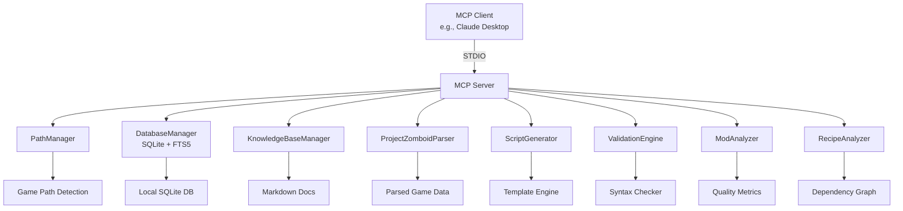
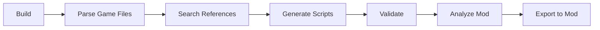

# 🧟 Project Zomboid MCP Server

<div align="center">


**🔧 Supercharge Your PZ Mod Development with AI-Powered Tools**

[Features](#-features) • [Installation](#-installation) • [Usage](#-usage) • [Tools](#-mcp-tools) • [Contributing](#-contributing)

</div>

---

## 🎯 Overview

<div align="center">

```
╔═══════════════════════════════════════════════════════════════╗
║     🎮 Project Zomboid + 🤖 AI = ⚡ Ultimate Mod Development   ║
╚═══════════════════════════════════════════════════════════════╝
```

</div>

A **local-only Model Context Protocol (MCP)** stdio server designed specifically for **Project Zomboid mod developers**. Connect seamlessly with any MCP client (Claude Desktop, etc.) to get intelligent assistance with script validation, generation, recipe analysis, and workshop integration.

---

## ✨ Features

<div align="center">

<table>
<tr>
<td align="center">
<svg width="60" height="60" viewBox="0 0 24 24" fill="none" xmlns="http://www.w3.org/2000/svg">
<circle cx="12" cy="12" r="10" stroke="#4CAF50" stroke-width="2"/>
<path d="M8 12l3 3 5-5" stroke="#4CAF50" stroke-width="2" stroke-linecap="round" stroke-linejoin="round"/>
</svg>
<br/><b>Smart Validation</b>
<br/><small>Syntax & reference checking</small>
</td>
<td align="center">
<svg width="60" height="60" viewBox="0 0 24 24" fill="none" xmlns="http://www.w3.org/2000/svg">
<rect x="3" y="3" width="18" height="18" rx="2" stroke="#2196F3" stroke-width="2"/>
<path d="M9 9h6M9 12h6M9 15h4" stroke="#2196F3" stroke-width="2" stroke-linecap="round"/>
</svg>
<br/><b>Script Generation</b>
<br/><small>Template-based scaffolding</small>
</td>
<td align="center">
<svg width="60" height="60" viewBox="0 0 24 24" fill="none" xmlns="http://www.w3.org/2000/svg">
<circle cx="11" cy="11" r="8" stroke="#FF9800" stroke-width="2"/>
<path d="M21 21l-4.35-4.35" stroke="#FF9800" stroke-width="2" stroke-linecap="round"/>
</svg>
<br/><b>Deep Search</b>
<br/><small>Vanilla data & knowledge base</small>
</td>
<td align="center">
<svg width="60" height="60" viewBox="0 0 24 24" fill="none" xmlns="http://www.w3.org/2000/svg">
<path d="M12 2L2 7l10 5 10-5-10-5z" stroke="#9C27B0" stroke-width="2"/>
<path d="M2 17l10 5 10-5M2 12l10 5 10-5" stroke="#9C27B0" stroke-width="2"/>
</svg>
<br/><b>Mod Analysis</b>
<br/><small>Structure, balance & compatibility</small>
</td>
</tr>
</table>

</div>

---

## 🛠️ Available Tools

### 🔍 Discovery & Search

| Tool | Description | Icon |
|------|-------------|------|
| `search_vanilla` | Full-text search of parsed game data (items, recipes, sounds, vehicles) | 🔎 |
| `search_knowledge_base` | Search indexed modding documentation with relevance ranking | 📚 |
| `list_knowledge_topics` | List all indexed topics with statistics | 📋 |
| `workshop_search` | Browse Steam Workshop items | 🛒 |
| `workshop_get_details` | Get full metadata for workshop items | ℹ️ |

### 📝 Script Operations

| Tool | Description | Icon |
|------|-------------|------|
| `generate_script` | Generate item, recipe, fixing, sound, evolvedrecipe, vehicle scripts | ✏️ |
| `validate_script` | Syntax and reference validation with suggestions | ✅ |
| `check_references` | Validate references against parsed database | 🔗 |
| `export_mod_script` | Write generated scripts directly to mod folders | 💾 |

### 🔬 Analysis Tools

| Tool | Description | Icon |
|------|-------------|------|
| `analyze_mod` | Comprehensive mod directory analysis | 📊 |
| `parse_game_files` | Parse PZ game files into local SQLite database | 🗄️ |
| `index_knowledge_base` | Index markdown docs into searchable FTS database | 📖 |
| `analyze_recipe_chain` | Walk recipe dependency graphs | 🔗 |
| `detect_recipe_conflicts` | Find duplicate crafting paths | ⚠️ |
| `workshop_analyze` | Download, parse & analyze workshop mods | 📦 |

---

## 🚀 Quick Start

<div align="center">

```bash
# Clone the repository
git clone https://github.com/shakoorpour1991-sketch/pz-mcp-server.git

# Navigate to project
cd pz-mcp-server

# Install dependencies
npm install

# Build the server
npm run build

# Run the server
npm start
```

</div>

---

## 🔌 Integration

### Claude Desktop Setup

Add this configuration to your `claude_desktop_config.json`:

```json
{
  "mcpServers": {
    "pz-mcp-server": {
      "command": "node",
      "args": ["/absolute/path/to/pz-mcp-server/dist/index.js"]
    }
  }
}
```

<div align="center">


</div>

---

## 📊 Architecture



---

## ⚙️ Configuration

### Environment Variables

| Variable | Default | Purpose |
|----------|---------|---------|
| `PZ_MCP_DATA_DIR` | `./data` | SQLite database directory |
| `PZ_MCP_KB_PATH` | `D:\PZ-Modding\Documentation` | Knowledge base path |
| `PZ_MCP_LOG_LEVEL` | `info` | Logging level |
| `PZ_GAME_VERSION` | `42.20` | Target game version |
| `PROJECTZOMBOID_PATH` | Auto-detect | Custom game install path |
| `PZ_DECK_PORT` | `8787` | Admin dashboard port |

---

## 📈 Development Workflow

<div align="center">



</div>

---

## 🎮 Supported Features

- ✅ **Build 42 Compatible** - Latest game structure support
- ✅ **Local Only** - No external API calls required
- ✅ **Multiple Script Types** - Items, recipes, sounds, vehicles & more
- ✅ **Balance Analysis** - Vanilla, powerful, weak modes
- ✅ **WSL Support** - Windows Subsystem for Linux detection
- ✅ **SteamCMD Integration** - Workshop download & analysis
- ✅ **Full-Text Search** - FTS5-powered rapid lookups
- ✅ **Structured Output** - Machine-readable `structuredContent` field

---

## 📝 License

<div align="center">

[](https://opensource.org/licenses/MIT)

**Built with ❤️ for the Project Zomboid modding community**

</div>

---

<div align="center">

### 🌟 Star this repo if you find it useful!

[Report Issues](https://github.com/shakoorpour1991-sketch/pz-mcp-server/issues) • [View Changelog](CHANGELOG.md) • [Join Discussion](https://github.com/shakoorpour1991-sketch/pz-mcp-server/discussions)

</div>
