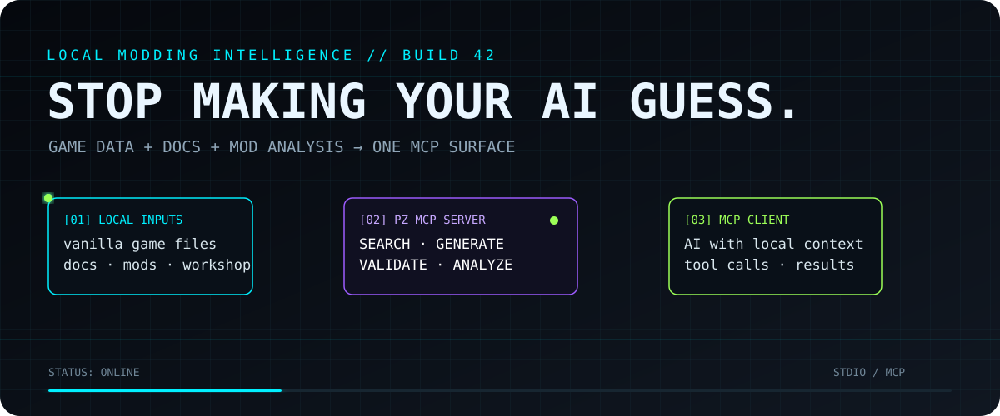
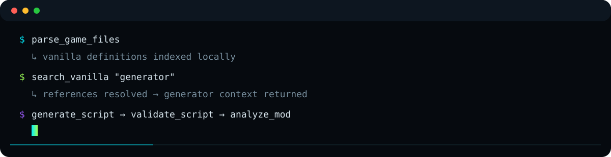
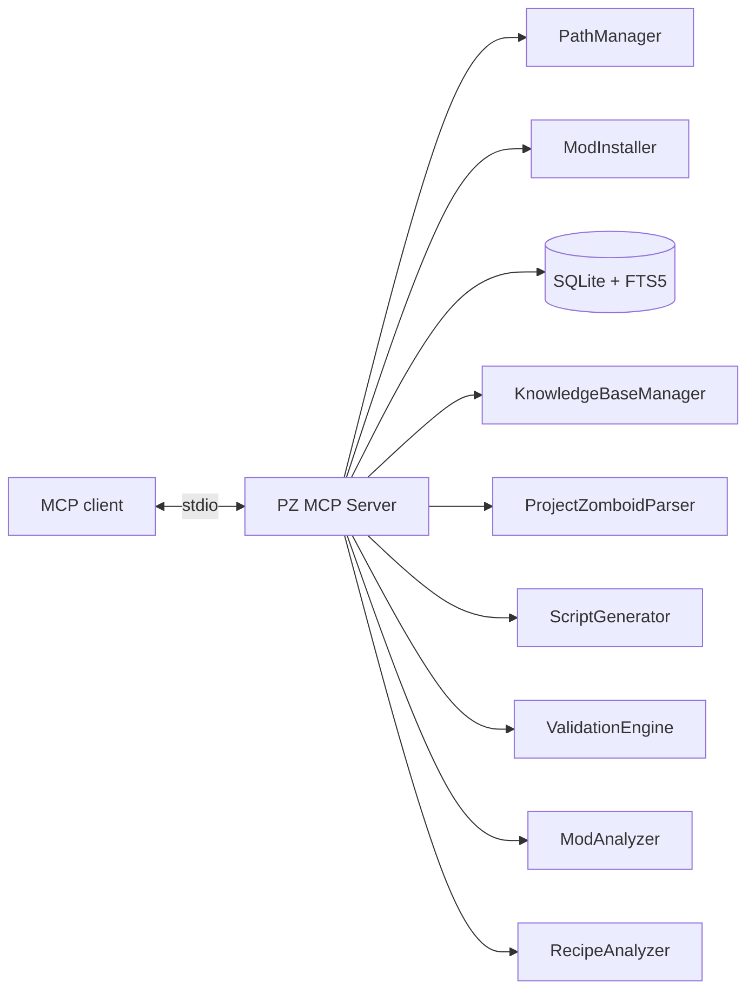

<p align="center">
  
</p>

<p align="center">
  
</p>

> **PROJECT ZOMBOID MODDING TOOLS FOR AN AI THAT CAN INSPECT THE SAME LOCAL MATERIAL YOU DO.**

[Start here](#start-here) · [Tool map](#tool-map) · [System flow](#system-flow) · [Configuration](#configuration)

<p align="center"></p>

## System flow

<p align="center">
  
</p>

```text
Project Zomboid install        Modding documentation        Existing mod / Workshop mod
          │                            │                              │
          └──────────────┬─────────────┴──────────────┬───────────────┘
                         ▼                            ▼
                   parse / index                  inspect / analyze
                         \                            /
                          ▼                          ▼
                   ┌────────────────────────────────────┐
                   │           PZ MCP SERVER            │
                   │                                    │
                   │ SEARCH · GENERATE · VALIDATE       │
                   │ ANALYZE · TRACE RECIPE CHAINS      │
                   └─────────────────┬──────────────────┘
                                     │ MCP / stdio
                                     ▼
                              Your MCP client
```

A typical path is:

**parse game files → search references → generate a script → validate it → analyze the mod → export**

<p align="center"></p>

## What the server actually does

### `[ SEARCH ]` Find the source material

- Search parsed vanilla **items, recipes, sounds, and vehicles**.
- **Validate AI-generated scripts** with deterministic diagnostics ported from the [ZedScripts](https://github.com/PZ-Wiki-Modding/ZedScripts) extension (unknown parameters with typo suggestions, missing required parameters, invalid values, wrong types, deprecated parameters, missing commas, malformed blocks, craftRecipe input/output issues) — `validate_script` and `analyze_mod` report file/line/column + diagnostic code + suggestion so agents can fix and revalidate. The knowledge layer covers **all 97 dataset block types** (`entity`, `model`, `fluid`, `physics`, `timedAction`, `character_trait_definition`, `component *`, …) including **nested blocks** and hierarchy checks (`WRONG_PARENT`/`MISSING_PARENT`), and `modgen_generate`/`modgen_regenerate` surface the same structured diagnostics on every generated mod. **Verified game data wins:** block keywords and parameters the real game ships but the dataset omits (`xuiConfig`, SpriteConfig extras, `part` `hasLightsRear`, …) are accepted via a mechanically regenerable vanilla-verified table (`vanillaVerified.json` + `scripts/_extract_vanilla_verified.mjs`), so the engine reports zero errors over the entire vanilla script tree — its only warnings are genuine dataset-documented deprecations.
- Index Markdown modding documentation into a searchable knowledge base.
- Ingest **JavaDocs** (`index_javadocs`) — the repo ships the distilled per-type API reference (`knowledge-base/javadocs/`, ~4,700 types) so indexing works on any machine with no arguments; optionally re-ingest a raw generated JavaDocs HTML tree into structured API knowledge (packages, FQNs, methods, fields, params, return types, signatures, inheritance) indexed alongside the markdown docs.
- List indexed knowledge topics.
- Search the Project Zomboid Steam Workshop and retrieve item details.

### `[ BUILD ]` Generate and check scripts

The script generator covers:

`item` · `recipe` · `fixing` · `sound` · `evolvedrecipe` · `vehicle`

Generated scripts can then be:

- syntax-validated,
- checked against parsed references,
- exported into a mod folder, with dry-run behavior available.

### `[ ANALYZE ]` Inspect the mod, not just the text

The analysis tools cover:

- mod structure,
- Lua syntax,
- balance and compatibility checks,
- recipe dependency traversal,
- duplicate crafting-path detection,
- Workshop download and analysis through SteamCMD.

### `[ MANAGE ]` Build and manage mod projects

The Mod Workspace turns the server into a dev environment for **creating** mods, not just reading them:

- scaffold a valid Build-42 mod (metadata, poster, `common/` + versioned `media/`),
- inspect, validate, and report project status (metadata, builds, dependencies, content types, errors),
- list/read/write/patch/delete/rename project files — all strictly confined to the workspace root,
- atomic writes, explicit overwrite intent, safe context patches, and dry-run previews for every destructive op.

Full reference: [`docs/mod-workspace.md`](docs/mod-workspace.md).

### `[ INSTALL ]` Detect your game and install mods

The server finds your Project Zomboid installation **on any machine** and can install mods for you:

- **Smart detection** — game install, user-data dir, mods dir and Steam Workshop dir, resolved via env override → Steam registry → `libraryfolders.vdf` → common install paths (Windows / Linux / macOS / WSL).
- **Mod installer** — takes a `.zip` archive **or** a mod folder and installs every mod inside it into `<home>/Zomboid/mods`: single mods, Build-42 versioned folders (`MyMod/42/…`), multi-mod workshop packs and flat zips all work. Unsafe archives (zip-slip, symlinks, macOS junk) are refused/filtered, conflicts are detected by folder name _and_ `mod.info` id and skipped by default, `dryRun` previews the plan with zero disk changes, and nothing is ever overwritten unless `overwrite: true`.
- **Control Deck Installer tab** — drag & drop `.zip` files or whole mod folders (or browse), watch uploads → install → result badges, and override the mods directory per machine (`PZ_MODS_DIR`).

<p align="center"></p>

## Tool map

| Channel         | Tools                                                                                             |
| --------------- | ------------------------------------------------------------------------------------------------- |
| `DISCOVERY`     | `search_vanilla` (v2: structured filters, fuzzy resolution, AI context, relations, provenance) · `search_knowledge_base` · `get_knowledge_section` · `list_knowledge_topics` |
| `SCRIPT`        | `generate_script` · `validate_script` · `check_references` · `export_mod_script`                  |
| `LOCAL DATA`    | `parse_game_files` · `index_knowledge_base` · `index_javadocs`                                    |
| `ANALYSIS`      | `analyze_mod` · `analyze_recipe_chain` · `detect_recipe_conflicts`                                |
| `WORKSHOP`      | `workshop_search` · `workshop_get_details` · `workshop_download` · `workshop_analyze`             |
| `WORKSPACE`     | `workspace_list` · `workspace_create` · `workspace_inspect`                                       |
| `MOD GENERATOR` | `modgen_templates` · `modgen_generate` · `modgen_list` · `modgen_blueprint` · `modgen_regenerate` |
| `INSTALL`       | `detect_pz_paths` · `install_mod`                                                                 |

Tools are documented as returning human-readable text alongside machine-readable MCP `structuredContent`.

For parameters and examples: [`TOOLS.md`](TOOLS.md).

## Why this exists

Project Zomboid modding requires moving between vanilla definitions, references, local notes, script templates, generated content, validation results, and mod-level analysis.

PZ MCP Server puts those operations behind one MCP interface. The client can request information and actions through tools rather than relying only on whatever text was manually placed into its context.

The repository describes the core game-data and documentation workflow as local/offline. Workshop operations are separate because they interact with Steam Workshop and SteamCMD.

<p align="center"></p>

## Start here

```bash
git clone https://github.com/shakoorpour1991-sketch/pz-mcp-server.git
cd pz-mcp-server
npm install
npm run build
```

The repository documentation specifies **Node.js ≥ 22.5**.

A stdio MCP configuration has this shape:

```json
{
  "mcpServers": {
    "pz-mcp-server": {
      "command": "node",
      "args": ["/absolute/path/to/pz-mcp-server/dist/index.js"]
    }
  }
}
```

Run the compiled server with:

```bash
npm start
```

## Compatibility

| Layer           | Support                                                                                                                                  |
| --------------- | ---------------------------------------------------------------------------------------------------------------------------------------- |
| Node.js         | **≥ 22.5** — required for the built-in `node:sqlite`; earlier versions fail at runtime                                                   |
| OS              | Windows 10/11 (primary), Linux, macOS; WSL is supported for game-path detection                                                          |
| Project Zomboid | **Build 42.20 verified** (`PZ_GAME_VERSION`) — B42 grammar: items, `craftRecipe` (inputs/outputs), evolvedrecipe, fixing, sound, vehicle |

## Example workflows

**Core loop** (local/offline):

```text
parse_game_files        # index the vanilla game into the SQLite DB
  → search_vanilla      # find the source material (item, recipe, sound, vehicle)
  → generate_script     # create a balanced script from a template
  → validate_script     # syntax + reference check + ZedScripts knowledge-layer diagnostics
  → analyze_mod          # whole-mod report: structure, scripts (per-file/line diagnostics), Lua, balance
  → export_mod_script   # dry-run, then write into a mod's media/scripts
```

**Knowledge base**: `index_knowledge_base` once, then `search_knowledge_base` / `get_knowledge_section` / `list_knowledge_topics` for every lookup. Docs are stored as **section chunks** (per-method/field for JavaDocs), topics are path-prefixed (`wiki/Java`, `javadocs/zombie.iso.IsoObject`), and a chunk can be read directly via `knowledge://<topic>#<section>` or `get_knowledge_section` (matches a heading or javadocs member by name — `getPlayer`, no slug guessing). Search is **type-aware** — natural-language queries rank prose docs (wiki/research/api-docs) before the javadocs constant flood, identifier queries (`getPlayer`, `Base.Hammer`) rank javadocs first, and bodyless bare-signature chunks are downweighted; bm25 weights favor titles/signatures over bodies, the last term is prefix-matched only as a fallback (`"cooking"` no longer matches `cookie`), and `search_knowledge_base` supports `types` multi-select, `includeContent` (search + read in one call, budget-capped) and per-result `chars`/`words` so agents can budget context before reading.

**Java API docs**: `index_javadocs` (no arguments) indexes the **repo-shipped distilled JavaDocs markdown** (`knowledge-base/javadocs/` — one file per API type, ~4,700 classes/interfaces/enums/records from the Unofficial PZ JavaDocs) so it works on any machine. Then `search_knowledge_base` returns Java API results alongside your markdown notes — search a class, interface, method, or field name directly. To re-ingest from a raw generated JavaDocs HTML tree (e.g. after regenerating the docs), pass `source` pointing at the tree; the pipeline recursively discovers every class page, parses it programmatically (no manual file lists), and indexes one markdown doc per type under its fully-qualified name (`zombie.iso.IsoObject`), tagged with the docs version.

**Mod/recipe analysis**: `analyze_mod` for structure/Lua/balance, `analyze_recipe_chain` to walk what makes/consumes an item, `detect_recipe_conflicts` for duplicate crafting paths.

**Workshop (external)**: `workshop_search` → `workshop_get_details` → `workshop_download` (dry-run first) → `workshop_analyze` for a full Mod Report.

**Mod workspace (local dev)**: `workspace_create` a B42-scaffolded project → `workspace_inspect` for the full validation report (structure, metadata, dependencies, recommendations) → iterate by editing files in the project folder → `workspace_inspect` again. Full walkthrough in [`docs/mod-workspace.md`](docs/mod-workspace.md).

**Mod Generator (beginner-friendly)**: `modgen_templates` to see the five templates (Simple Item, Melee Weapon, Food, Tool, Clothing) with their Build 42 item classes, maturity levels and verified icon suggestions → `modgen_generate` creates a complete ready-to-ship **Build 42** folder (`ItemType = base:*` script, ItemName translation file, generated poster, mod.info, workshop.txt, README, editable blueprint) with stats **auto-balanced from real vanilla game data** and **Build 42 validation before anything is written** → reopen any time with `modgen_blueprint` → `modgen_regenerate` after editing stats (or `randomize: ["MaxDamage"]` to re-roll one). The Control Deck's **Generator** tab wraps the whole flow — pick a template, tune stats with per-stat dice / auto badges, generate, and install into your game.

**Install & detect**: `detect_pz_paths` once to confirm the game install + mods dir → `install_mod` with a `.zip` or folder source (`dryRun: true` first to preview, `overwrite: true` to replace a conflicting mod). The Control Deck's **Installer** tab wraps this whole flow with drag & drop / browse.

## Internal map



The server is therefore not only a search index: the same MCP surface also reaches generation, validation, analysis, and export-oriented operations.

## Configuration

| Variable                          | Default                              | Purpose                                                                                                                 |
| --------------------------------- | ------------------------------------ | ----------------------------------------------------------------------------------------------------------------------- |
| `PZ_MCP_DATA_DIR`                 | `./data`                             | SQLite database directory                                                                                               |
| `PZ_MCP_WORKSPACE_DIR`            | `<data>/workspaces`                  | Mod workspace root — every `workspace_*` file operation is strictly confined here                                       |
| `PZ_MCP_KB_PATH`                  | `knowledge-base/` (shipped docs)     | Knowledge-base documentation path                                                                                       |
| `PZ_MCP_JAVADOCS_PATH`            | `knowledge-base/javadocs/` (shipped) | Distilled JavaDocs markdown dir that `index_javadocs` indexes by default                                                |
| `PZ_MCP_JAVADOCS_KB_DIR`          | `<data>/javadocs-kb`                 | Where `index_javadocs` writes re-generated per-type markdown (when `source` is provided) before indexing it into the KB |
| `PZ_MCP_LOG_LEVEL`                | `info`                               | pino level: `trace`, `debug`, `info`, `warn`, `error`, `fatal`, `silent`                                                |
| `PZ_GAME_VERSION`                 | `42.20`                              | Game build for compatibility checks                                                                                     |
| `PROJECTZOMBOID_PATH` / `PZ_PATH` | auto-detect                          | Override Project Zomboid installation detection                                                                         |
| `PZ_MODS_DIR`                     | `<home>/Zomboid/mods`                | Where `install_mod` drops mods (also settable from the Control Deck → Installer tab)                                    |
| `PZ_DECK_PORT`                    | `8787`                               | Admin dashboard port                                                                                                    |
| `PZ_WORKSHOP_DIR`                 | Steam install                        | Workshop download target (else `<Steam>/steamapps/workshop/content/108600`)                                             |
| `PZ_MCP_MAX_DOWNLOAD_BYTES`       | `4294967296` (4 GiB)                 | Workshop download size cap — larger items are refused before downloading                                                |
| `STEAMCMD_PATH`                   | common paths                         | Path to the `steamcmd` binary (auto-probed if unset)                                                                    |
| `STEAMCMD_USER` / `STEAMCMD_PASS` | —                                    | Credentials for non-anonymous workshop downloads (see SteamCMD setup)                                                   |
| `STEAMCMD_USE_CREDENTIALS`        | `0`                                  | Set to `1` to allow passing credentials to steamcmd                                                                     |

The documented game-path detection covers standard Windows locations and WSL; set `PROJECTZOMBOID_PATH` when automatic detection misses the installation.

All variables are validated at startup through a single Zod schema — invalid values (e.g. a bad log level) fail fast with a per-variable error instead of surfacing as confusing runtime behavior.

### Database lifecycle & reset

The SQLite databases live in `PZ_MCP_DATA_DIR` (default `./data`):

- `pz_database.db` — parsed game/mod content (items, recipes, references)
- `pz_knowledge.db` — indexed knowledge-base docs
- `javadocs-kb/` — re-generated per-type Java API markdown (written by `index_javadocs` when `source` is provided, then indexed into `pz_knowledge.db`); the default shipped set lives in the repo at `knowledge-base/javadocs/`
- `workshop_metadata.json` — 24h Workshop metadata cache

The databases are a **disposable cache**, not persistent user state: they are rebuilt by `parse_game_files` / `index_knowledge_base` / `index_javadocs`. To reset everything, stop the server and delete the `data/` directory (or pass `forceReparse: true` to `parse_game_files` to re-parse in place). The schema is versioned internally (`PRAGMA user_version`) and migrated automatically on boot.

### SteamCMD setup (workshop download / analyze)

`workshop_download` and `workshop_analyze` need Valve's [SteamCMD](https://developer.valvesoftware.com/wiki/SteamCMD):

1. Install SteamCMD and make sure the binary is discoverable — set `STEAMCMD_PATH`, or drop `steamcmd.exe` into `C:\steamcmd` / a common Steam folder.
2. Downloads land in `PZ_WORKSHOP_DIR` (default: `<Steam>/steamapps/workshop/content/108600`).
3. Anonymous downloads cover public items. For items requiring a subscription, set `STEAMCMD_USER` + `STEAMCMD_PASS` **and** `STEAMCMD_USE_CREDENTIALS=1` — credentials are never passed on the command line unless you explicitly opt in, because argv is visible in process listings.

Downloaded mods are read/analyzed only — they are never executed and never auto-installed into the live game.

## Development

| Command               | Purpose                                                 |
| --------------------- | ------------------------------------------------------- |
| `npm run build`       | Compile TypeScript                                      |
| `npm run dev`         | Run with `tsx` in development mode                      |
| `npm start`           | Run the compiled server                                 |
| `npm run lint`        | Run ESLint                                              |
| `npm test`            | Build + run the full test suite (559 tests / 111 suites) |
| `npm run coverage`    | Test coverage report (after `npm test` has built)       |
| `npm run benchmark`   | Hermetic DB/FTS performance baselines                   |
| `npm run verify:deck` | Admin dashboard smoke check                             |

## Current boundaries

This README does **not** claim that the server can automatically **launch or play-test** a Project Zomboid mod — the workspace can create, edit, validate, and inspect mod projects, but game launching/testing is out of scope for now. The Mod Workspace layer (`src/workspace/`) is the intended foundation for that next step.

It also avoids unsupported performance claims and compatibility promises.

## Security & side-effect model

MCP clients can drive tools autonomously, so the server separates capabilities into three trust tiers:

| Tier                      | Tools                                                                                                                                                                                                                                                                                     | Side effects                                                                                                                                                                                            |
| ------------------------- | ----------------------------------------------------------------------------------------------------------------------------------------------------------------------------------------------------------------------------------------------------------------------------------------- | ------------------------------------------------------------------------------------------------------------------------------------------------------------------------------------------------------- |
| **READ-ONLY**             | `search_*`, `list_*`, `check_references`, `analyze_mod`, `analyze_recipe_chain`, `detect_recipe_conflicts`, `workshop_search`, `workshop_get_details`, `generate_script`, `validate_script`, `workspace_list`, `workspace_inspect`, `modgen_templates`, `modgen_list`, `modgen_blueprint` | None — pure inspection                                                                                                                                                                                  |
| **LOCAL MUTATION**        | `parse_game_files`, `index_knowledge_base`, `index_javadocs`, `export_mod_script`, `workspace_create`, `modgen_generate`, `modgen_regenerate`                                                                                                                                             | Writes to the DB under `PZ_MCP_DATA_DIR`, the explicitly provided mod path (path-validated), or the workspace root only — traversal/symlink-escape rejected, atomic writes, dry-run for destructive ops |
| **EXTERNAL SIDE EFFECTS** | `workshop_download`, `workshop_analyze`                                                                                                                                                                                                                                                   | SteamCMD subprocess + downloads into `PZ_WORKSHOP_DIR`; `dryRun` preview available                                                                                                                      |

Hardening already in place:

- **Path safety** — user-supplied paths go through `validateInputPath` (absolute-only, no `..` traversal, existence check); export writes only under the validated mod's `media/scripts`; downloader output is contained in the workshop dir and item ids are validated.
- **External commands** — SteamCMD runs with a timeout, output is captured (never streamed to the wire), exit codes are checked, and downloads are app-verified (`108600`) with a size cap (`PZ_MCP_MAX_DOWNLOAD_BYTES`) before touching disk.
- **No execution of mod content** — downloaded mods are parsed/analyzed in a throwaway DB and never executed.
- **Error hygiene** — tool errors are mapped to structured MCP errors; internal error messages are sanitized (no stack traces, no absolute local paths leaked to the client).
- **Startup validation** — invalid environment configuration fails fast at boot.

## Troubleshooting

| Symptom                                                   | Fix                                                                                                                   |
| --------------------------------------------------------- | --------------------------------------------------------------------------------------------------------------------- |
| `Node.js >= 22.5 is required` / server exits at boot      | Update Node — `node:sqlite` is built-in from 22.5                                                                     |
| `Invalid environment configuration: PZ_MCP_LOG_LEVEL …`   | Check the listed variable — values are validated at startup                                                           |
| `SteamCMD not found`                                      | Install SteamCMD or set `STEAMCMD_PATH` (see SteamCMD setup)                                                          |
| `Could not determine the workshop content directory`      | Set `PZ_WORKSHOP_DIR` to a writable folder                                                                            |
| `Item … is … which exceeds the configured download limit` | Raise `PZ_MCP_MAX_DOWNLOAD_BYTES` if the item is legitimately large                                                   |
| `search_vanilla` returns nothing                          | Run `parse_game_files` first (the DB starts empty); use `forceReparse: true` after game updates                       |
| `Could not detect Project Zomboid installation`           | Set `PROJECTZOMBOID_PATH` to the install dir                                                                          |
| `Index … Database already contains data`                  | Pass `forceReparse: true` (or delete `data/` to reset)                                                                |
| Stale or missing knowledge results                        | Re-run `index_knowledge_base` (or `overwrite: true` for a full re-index)                                              |
| Java API search returns nothing                           | Run `index_javadocs` (no arguments — indexes the repo-shipped distilled JavaDocs; re-run after regenerating the docs) |
| SQLite lock errors with the dashboard open                | Both processes share the DB in WAL mode; wait a moment and retry                                                      |

<p align="center">
  
</p>

<p align="center">
  <strong>LOCAL DATA → MCP TOOLS → CONTEXTUAL AI ACTION</strong>
</p>

<p align="center">
  <a href="TOOLS.md">Tool reference</a> ·
  <a href="CHANGELOG.md">Changelog</a> ·
  <a href="https://github.com/shakoorpour1991-sketch/pz-mcp-server/issues">Issues</a> ·
  <a href="https://github.com/shakoorpour1991-sketch/pz-mcp-server/discussions">Discussions</a>
</p>
