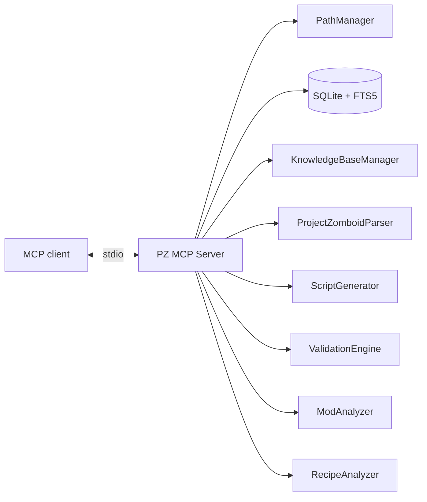

<p align="center">
  
</p>

<pre style="font-family:'Courier New',Courier,monospace;font-size:12px;line-height:1.17;white-space:pre;background-color:#000;color:#fff;padding:8px;margin:0;"><span style="color:#FFFFFF">▄</span><span style="color:#FF5555">▄▄▄▄▄▄▄</span><span style="color:#AAAAAA">   </span><span style="color:#FFFFFF">▄</span><span style="color:#FF5555">▄▄▄▄▄▄▄</span><span style="color:#AAAAAA">            </span><span style="color:#FFFFFF">▄</span><span style="color:#55FFFF">▄</span><span style="color:#FF5555">▄▄▄▄</span><span style="color:#AAAAAA"> </span><span style="color:#AA5500">▄</span><span style="color:#FF5555">▄</span><span style="color:#AAAAAA">      </span><span style="color:#55FFFF">▄</span><span style="color:#FF5555">▄▄▄▄▄</span><span style="color:#AAAAAA">   </span><span style="color:#FFFFFF">▄</span><span style="color:#FF5555">▄▄▄▄▄▄▄</span><span style="color:#AAAAAA">  </span>
<span style="color:#FF5555">█</span><span style="color:#555555">▓▒░</span><span style="color:#AAAAAA">    </span><span style="color:#FF5555">▀▄</span><span style="color:#AAAAAA"> </span><span style="color:#FF5555">█</span><span style="color:#555555">▓▒░</span><span style="color:#AAAAAA">    </span><span style="color:#FF5555">▀▄</span><span style="color:#AAAAAA">          </span><span style="color:#FF5555">█</span><span style="color:#555555">▓▒░</span><span style="color:#AAAAAA">  </span><span style="color:#FF5555">▀</span><span style="color:#55FFFF">▀</span><span style="color:#AAAAAA"> </span><span style="color:#AA5500">▀▄</span><span style="color:#AAAAAA">  </span><span style="color:#55FFFF">▄</span><span style="color:#FFFFFF;background-color:#AA5500">▀</span><span style="color:#555555">▒░</span><span style="color:#AAAAAA">    </span><span style="color:#AA5500">▀▄</span><span style="color:#AAAAAA"> </span><span style="color:#FF5555">█</span><span style="color:#555555">▓▒░</span><span style="color:#AAAAAA">    </span><span style="color:#FF5555">▀▄</span>
<span style="color:#FF5555">█</span><span style="color:#555555">▒░</span><span style="color:#AAAAAA"> </span><span style="color:#FF5555;background-color:#AA5500">▓</span><span style="color:#FF5555">▀</span><span style="color:#FF5555;background-color:#AA5500">░</span><span style="color:#AAAAAA">  </span><span style="color:#FF5555;background-color:#AA5500">▓</span><span style="color:#AAAAAA"> </span><span style="color:#FF5555">█</span><span style="color:#555555">▒░</span><span style="color:#AAAAAA"> </span><span style="color:#FF5555;background-color:#AAAAAA">▄</span><span style="color:#FF5555">▀▄</span><span style="color:#AAAAAA">  </span><span style="color:#FF5555;background-color:#AA5500">▓</span><span style="color:#AAAAAA">          </span><span style="color:#FF5555">█</span><span style="color:#555555">▒░</span><span style="color:#AAAAAA"> </span><span style="color:#AA5500">█▀</span><span style="color:#FF5555">▄</span><span style="color:#AA5500">▀▄</span><span style="color:#AAAAAA">  </span><span style="color:#FF5555;background-color:#AA5500">▓</span><span style="color:#AAAAAA"> </span><span style="color:#FF5555">█</span><span style="color:#555555">▒░</span><span style="color:#AAAAAA"> </span><span style="color:#FF5555">█▀▄</span><span style="color:#AAAAAA">  </span><span style="color:#FF5555;background-color:#AA5500">▓</span><span style="color:#AAAAAA"> </span><span style="color:#FF5555">█</span><span style="color:#555555">▒░</span><span style="color:#AAAAAA"> </span><span style="color:#FF5555;background-color:#AA5500">▓</span><span style="color:#FF5555">▀</span><span style="color:#FF5555;background-color:#AA5500">░</span><span style="color:#AAAAAA">  </span><span style="color:#FF5555;background-color:#AA5500">▓</span>
<span style="color:#FF5555">█</span><span style="color:#555555">░</span><span style="color:#AAAAAA">  </span><span style="color:#FF5555;background-color:#AA5500">▒</span><span style="color:#AAAAAA"> </span><span style="color:#FF5555;background-color:#AA5500">░</span><span style="color:#AAAAAA">  </span><span style="color:#FF5555;background-color:#AA5500">▒</span><span style="color:#AAAAAA"> </span><span style="color:#FF5555">█</span><span style="color:#555555">░</span><span style="color:#AAAAAA">  </span><span style="color:#FF5555;background-color:#AA5500">▒</span><span style="color:#AAAAAA"> </span><span style="color:#FF5555;background-color:#AA5500">▒</span><span style="color:#AAAAAA">  </span><span style="color:#FF5555;background-color:#AA5500">▓</span><span style="color:#AAAAAA">          </span><span style="color:#FF5555">█</span><span style="color:#555555">░</span><span style="color:#AAAAAA">  </span><span style="color:#AA5500">█</span><span style="color:#AAAAAA"> </span><span style="color:#FF5555;background-color:#AA5500">▓</span><span style="color:#AAAAAA"> </span><span style="color:#FF5555;background-color:#AA5500">░</span><span style="color:#AAAAAA">  </span><span style="color:#FF5555;background-color:#AA5500">▒</span><span style="color:#AAAAAA"> </span><span style="color:#FF5555">█</span><span style="color:#555555">░</span><span style="color:#AAAAAA">  </span><span style="color:#FF5555;background-color:#AA5500">▓</span><span style="color:#AAAAAA"> </span><span style="color:#FF5555;background-color:#AA5500">▒</span><span style="color:#AAAAAA">  </span><span style="color:#FF5555;background-color:#AA5500">▒</span><span style="color:#AAAAAA"> </span><span style="color:#FF5555">█</span><span style="color:#555555">░</span><span style="color:#AAAAAA">  </span><span style="color:#FF5555;background-color:#AA5500">▒</span><span style="color:#AAAAAA"> </span><span style="color:#FF5555;background-color:#AA5500">░</span><span style="color:#AAAAAA">  </span><span style="color:#FF5555;background-color:#AA5500">▒</span>
<span style="color:#FF5555">█</span><span style="color:#AAAAAA">   </span><span style="color:#FF5555">▀▀</span><span style="color:#55FFFF">▀</span><span style="color:#AAAAAA">  </span><span style="color:#AA5500">█</span><span style="color:#AAAAAA"> </span><span style="color:#AA5500">▀▀▀</span><span style="color:#FF5555;background-color:#AA5500">▄▄</span><span style="color:#FF5555">▄▀</span><span style="color:#AAAAAA">  </span><span style="color:#FF5555;background-color:#AA5500">░</span><span style="color:#AAAAAA"> </span><span style="color:#FFFFFF">▄</span><span style="color:#55FFFF">▄</span><span style="color:#FF5555">▄▄▄▄▄▄</span><span style="color:#AAAAAA"> </span><span style="color:#FF5555">█</span><span style="color:#AAAAAA">   </span><span style="color:#AA5500">█</span><span style="color:#AAAAAA"> </span><span style="color:#FF5555;background-color:#AA5500">▒</span><span style="color:#AAAAAA"> </span><span style="color:#FF5555;background-color:#AA5500">▒</span><span style="color:#AAAAAA">  </span><span style="color:#FF5555;background-color:#AA5500">░</span><span style="color:#AAAAAA"> </span><span style="color:#FF5555">█</span><span style="color:#AAAAAA">   </span><span style="color:#FF5555;background-color:#AA5500">▒</span><span style="color:#AAAAAA"> </span><span style="color:#FF5555;background-color:#AA5500">░</span><span style="color:#AA5500">▄▄█</span><span style="color:#AAAAAA"> </span><span style="color:#FF5555">█</span><span style="color:#AAAAAA">   </span><span style="color:#FF5555">▀▀</span><span style="color:#55FFFF">▀</span><span style="color:#AAAAAA">  </span><span style="color:#AA5500">█</span>
<span style="color:#FF5555;background-color:#AA5500">▓</span><span style="color:#AAAAAA">   </span><span style="color:#AA5500">▄▄▄▄▀</span><span style="color:#AAAAAA">   </span><span style="color:#FFFFFF">▄</span><span style="color:#55FFFF">▀</span><span style="color:#AAAAAA">   </span><span style="color:#AA5500">▄▄▀</span><span style="color:#AAAAAA">  </span><span style="color:#FF5555;background-color:#AA5500">░</span><span style="color:#555555">█▓▒░</span><span style="color:#AAAAAA">  </span><span style="color:#FF5555;background-color:#AA00AA">▒</span><span style="color:#AAAAAA"> </span><span style="color:#FF5555;background-color:#AA5500">▓</span><span style="color:#AAAAAA">   </span><span style="color:#AA5500">█</span><span style="color:#AAAAAA"> </span><span style="color:#AA5500;background-color:#AA0000">▓</span><span style="color:#AAAAAA"> </span><span style="color:#FF5555;background-color:#AA5500">▓</span><span style="color:#AAAAAA">  </span><span style="color:#AA5500">█</span><span style="color:#AAAAAA"> </span><span style="color:#FF5555;background-color:#AA5500">▓</span><span style="color:#AAAAAA">   </span><span style="color:#FF5555;background-color:#AA5500">░</span><span style="color:#AAAAAA">      </span><span style="color:#FF5555;background-color:#AA5500">▓</span><span style="color:#AAAAAA">   </span><span style="color:#AA5500">▄▄▄▄▀</span><span style="color:#AAAAAA"> </span>
<span style="color:#FF5555;background-color:#AA5500">▒</span><span style="color:#AAAAAA">   </span><span style="color:#AA5500;background-color:#AA00AA">░</span><span style="color:#AAAAAA">      ▄</span><span style="color:#55FFFF">▀</span><span style="color:#AAAAAA">  </span><span style="color:#FF5555">▄</span><span style="color:#AA5500">▀</span><span style="color:#AAAAAA">     </span><span style="color:#FF5555">▀</span><span style="color:#AA5500">▀▀▀▀▀</span><span style="color:#AA00AA">▀▀</span><span style="color:#AAAAAA"> </span><span style="color:#FF5555;background-color:#AA5500">▒</span><span style="color:#AAAAAA">   </span><span style="color:#AA5500;background-color:#AA00AA">▓</span><span style="color:#AAAAAA">   </span><span style="color:#FF5555;background-color:#AA5500">█</span><span style="color:#AAAAAA">  </span><span style="color:#AA5500;background-color:#AA00AA">▓</span><span style="color:#AAAAAA"> </span><span style="color:#FF5555;background-color:#AA5500">▒</span><span style="color:#AAAAAA">   </span><span style="color:#AA5500;background-color:#AA00AA">▓</span><span style="color:#AAAAAA"> </span><span style="color:#55FFFF;background-color:#AAAAAA">▀</span><span style="color:#AAAAAA">▀</span><span style="color:#AA5500">▀</span><span style="color:#AA5500;background-color:#AA00AA">▓</span><span style="color:#AAAAAA"> </span><span style="color:#FF5555;background-color:#AA5500">▒</span><span style="color:#AAAAAA">   </span><span style="color:#AA5500;background-color:#AA00AA">░</span><span style="color:#AAAAAA">     </span>
<span style="color:#FF5555;background-color:#AA5500">░</span><span style="color:#AAAAAA">   </span><span style="color:#AA5500;background-color:#AA00AA">▒</span><span style="color:#AAAAAA">      </span><span style="color:#FF5555;background-color:#AA5500">▓</span><span style="color:#AAAAAA">   </span><span style="color:#FF5555;background-color:#AA5500">▓</span><span style="color:#AAAAAA"> </span><span style="color:#FFFFFF;background-color:#AA5500">▀</span><span style="color:#AAAAAA">▀</span><span style="color:#AA5500">▀</span><span style="color:#AA5500;background-color:#AA00AA">▒</span><span style="color:#AAAAAA">          </span><span style="color:#FF5555;background-color:#AA5500">░</span><span style="color:#AAAAAA">   </span><span style="color:#AA5500;background-color:#AA00AA">▒</span><span style="color:#AAAAAA">   </span><span style="color:#FF5555;background-color:#AA5500">▓</span><span style="color:#AAAAAA">  </span><span style="color:#AA5500;background-color:#AA00AA">▒</span><span style="color:#AAAAAA"> </span><span style="color:#FF5555;background-color:#AA5500">░</span><span style="color:#AAAAAA">   </span><span style="color:#AA5500;background-color:#AA00AA">▒</span><span style="color:#AAAAAA"> </span><span style="color:#FF5555;background-color:#AA5500">▒</span><span style="color:#AAAAAA">  </span><span style="color:#AA5500;background-color:#AA00AA">▒</span><span style="color:#AAAAAA"> </span><span style="color:#FF5555;background-color:#AA5500">░</span><span style="color:#AAAAAA">   </span><span style="color:#AA5500;background-color:#AA00AA">▒</span><span style="color:#AAAAAA">     </span>
<span style="color:#AA5500;background-color:#AA5500">█</span><span style="color:#AAAAAA">  </span><span style="color:#AA00AA">░</span><span style="color:#AA5500;background-color:#AA00AA">░</span><span style="color:#AAAAAA">      </span><span style="color:#FF5555;background-color:#AA5500">▒</span><span style="color:#AAAAAA">   </span><span style="color:#FF5555;background-color:#AA5500">░</span><span style="color:#AA5500">▄</span><span style="color:#AA5500;background-color:#AA00AA">▒</span><span style="color:#AAAAAA"> </span><span style="color:#AA00AA">░</span><span style="color:#AA5500;background-color:#AA00AA">░</span><span style="color:#AAAAAA">          </span><span style="color:#AA5500">█</span><span style="color:#AAAAAA">  </span><span style="color:#AA00AA">░</span><span style="color:#AA5500;background-color:#AA00AA">░</span><span style="color:#AAAAAA">   </span><span style="color:#FF5555;background-color:#AA5500">▒</span><span style="color:#AAAAAA"> </span><span style="color:#AA00AA">░</span><span style="color:#AA5500;background-color:#AA00AA">░</span><span style="color:#AAAAAA"> </span><span style="color:#AA5500;background-color:#AA5500">█</span><span style="color:#AAAAAA">   </span><span style="color:#AA5500;background-color:#AA00AA">░</span><span style="color:#AA00AA">▄</span><span style="color:#FF5555;background-color:#AA00AA">░</span><span style="color:#AAAAAA"> </span><span style="color:#AA00AA">░</span><span style="color:#AA5500;background-color:#AA00AA">░</span><span style="color:#AAAAAA"> </span><span style="color:#AA5500;background-color:#AA5500">█</span><span style="color:#AAAAAA">  </span><span style="color:#AA00AA">░</span><span style="color:#AA5500;background-color:#AA00AA">░</span><span style="color:#AAAAAA">     </span>
<span style="color:#AA5500;background-color:#AA5500">█</span><span style="color:#AAAAAA"> </span><span style="color:#AA00AA">░▓█</span><span style="color:#AAAAAA">      </span><span style="color:#FF5555;background-color:#AA5500">░</span><span style="color:#AAAAAA">      </span><span style="color:#AA00AA">░▒█</span><span style="color:#AAAAAA">          </span><span style="color:#AA5500">█</span><span style="color:#AAAAAA"> </span><span style="color:#AA00AA">░▒█</span><span style="color:#AAAAAA">   </span><span style="color:#FF5555;background-color:#AA5500">░</span><span style="color:#AA00AA">░▒█</span><span style="color:#AAAAAA"> </span><span style="color:#AA5500">▀▄</span><span style="color:#AAAAAA">     </span><span style="color:#AA00AA">░▓▀</span><span style="color:#AAAAAA"> </span><span style="color:#AA5500;background-color:#AA5500">█</span><span style="color:#AAAAAA"> </span><span style="color:#AA00AA">░▓█</span><span style="color:#AAAAAA">     </span>
<span style="color:#AA5500">▀</span><span style="color:#AA00AA">▀</span><span style="color:#AA5500">▀</span><span style="color:#AA00AA">▀▀</span><span style="color:#AAAAAA">      </span><span style="color:#AA5500">▀</span><span style="color:#AA00AA">▀</span><span style="color:#AA5500">▀</span><span style="color:#AA00AA">▀▀▀▀▀▀▀</span><span style="color:#AAAAAA">          </span><span style="color:#AA5500">▀</span><span style="color:#AA00AA">▀</span><span style="color:#AA5500">▀</span><span style="color:#AA00AA">▀▀</span><span style="color:#AAAAAA">   </span><span style="color:#AA5500">▀▀</span><span style="color:#AA00AA">▀▀</span><span style="color:#AAAAAA">   </span><span style="color:#AA5500">▀</span><span style="color:#AA00AA">▀▀▀▀▀</span><span style="color:#AAAAAA">   </span><span style="color:#AA5500">▀</span><span style="color:#AA00AA">▀</span><span style="color:#AA5500">▀</span><span style="color:#AA00AA">▀▀</span><span style="color:#AAAAAA">     </span></pre>

> **PROJECT ZOMBOID MODDING TOOLS FOR AN AI THAT CAN INSPECT THE SAME LOCAL MATERIAL YOU DO.**

[Start here](#start-here) · [Tool map](#tool-map) · [System flow](#system-flow) · [Configuration](#configuration)

<p align="center"></p>

## System flow

<p align="center">
  
</p>

```text
Project Zomboid install        Modding documentation        Existing mod / Workshop mod
          │                            │                              │
          └──────────────┬─────────────┴──────────────┬───────────────┘
                         ▼                            ▼
                   parse / index                  inspect / analyze
                         \                            /
                          ▼                          ▼
                   ┌────────────────────────────────────┐
                   │           PZ MCP SERVER            │
                   │                                    │
                   │ SEARCH · GENERATE · VALIDATE       │
                   │ ANALYZE · TRACE RECIPE CHAINS      │
                   └─────────────────┬──────────────────┘
                                     │ MCP / stdio
                                     ▼
                              Your MCP client
```

A typical path is:

**parse game files → search references → generate a script → validate it → analyze the mod → export**

<p align="center"></p>

## What the server actually does

### `[ SEARCH ]` Find the source material

- Search parsed vanilla **items, recipes, sounds, and vehicles**.
- Index Markdown modding documentation into a searchable knowledge base.
- List indexed knowledge topics.
- Search the Project Zomboid Steam Workshop and retrieve item details.

### `[ BUILD ]` Generate and check scripts

The script generator covers:

`item` · `recipe` · `fixing` · `sound` · `evolvedrecipe` · `vehicle`

Generated scripts can then be:

- syntax-validated,
- checked against parsed references,
- exported into a mod folder, with dry-run behavior available.

### `[ ANALYZE ]` Inspect the mod, not just the text

The analysis tools cover:

- mod structure,
- Lua syntax,
- balance and compatibility checks,
- recipe dependency traversal,
- duplicate crafting-path detection,
- Workshop download and analysis through SteamCMD.

<p align="center"></p>

## Tool map

| Channel | Tools |
|---|---|
| `DISCOVERY` | `search_vanilla` · `search_knowledge_base` · `list_knowledge_topics` |
| `SCRIPT` | `generate_script` · `validate_script` · `check_references` · `export_mod_script` |
| `LOCAL DATA` | `parse_game_files` · `index_knowledge_base` |
| `ANALYSIS` | `analyze_mod` · `analyze_recipe_chain` · `detect_recipe_conflicts` |
| `WORKSHOP` | `workshop_search` · `workshop_get_details` · `workshop_download` · `workshop_analyze` |

Tools are documented as returning human-readable text alongside machine-readable MCP `structuredContent`.

For parameters and examples: [`TOOLS.md`](TOOLS.md).

## Why this exists

Project Zomboid modding requires moving between vanilla definitions, references, local notes, script templates, generated content, validation results, and mod-level analysis.

PZ MCP Server puts those operations behind one MCP interface. The client can request information and actions through tools rather than relying only on whatever text was manually placed into its context.

The repository describes the core game-data and documentation workflow as local/offline. Workshop operations are separate because they interact with Steam Workshop and SteamCMD.

<p align="center"></p>

## Start here

```bash
git clone https://github.com/shakoorpour1991-sketch/pz-mcp-server.git
cd pz-mcp-server
npm install
npm run build
```

The repository documentation specifies **Node.js ≥ 22.5**.

A stdio MCP configuration has this shape:

```json
{
  "mcpServers": {
    "pz-mcp-server": {
      "command": "node",
      "args": ["/absolute/path/to/pz-mcp-server/dist/index.js"]
    }
  }
}
```

Run the compiled server with:

```bash
npm start
```

## Internal map



The server is therefore not only a search index: the same MCP surface also reaches generation, validation, analysis, and export-oriented operations.

## Configuration

| Variable | Default | Purpose |
|---|---|---|
| `PZ_MCP_DATA_DIR` | `./data` | SQLite database directory |
| `PZ_MCP_KB_PATH` | `D:\PZ-Modding\Documentation` | Knowledge-base documentation path |
| `PZ_MCP_LOG_LEVEL` | `info` | `debug`, `info`, `warn`, or `error` |
| `PZ_GAME_VERSION` | `42.20` | Game build for compatibility checks |
| `PROJECTZOMBOID_PATH` / `PZ_PATH` | auto-detect | Override Project Zomboid installation detection |
| `PZ_DECK_PORT` | `8787` | Admin dashboard port |

The documented game-path detection covers standard Windows locations and WSL; set `PROJECTZOMBOID_PATH` when automatic detection misses the installation.

## Development

| Command | Purpose |
|---|---|
| `npm run build` | Compile TypeScript |
| `npm run dev` | Run with `tsx` in development mode |
| `npm start` | Run the compiled server |
| `npm run lint` | Run ESLint |
| `npm test` | Run the test suite |

## Current boundaries

This README does **not** claim that the server can automatically create, launch, or play-test a Project Zomboid mod. That is not established by the supplied repository documentation.

It also avoids unsupported performance claims and compatibility promises.

<p align="center">
  
</p>

<p align="center">
  <strong>LOCAL DATA → MCP TOOLS → CONTEXTUAL AI ACTION</strong>
</p>

<p align="center">
  <a href="TOOLS.md">Tool reference</a> ·
  <a href="CHANGELOG.md">Changelog</a> ·
  <a href="https://github.com/shakoorpour1991-sketch/pz-mcp-server/issues">Issues</a> ·
  <a href="https://github.com/shakoorpour1991-sketch/pz-mcp-server/discussions">Discussions</a>
</p>
