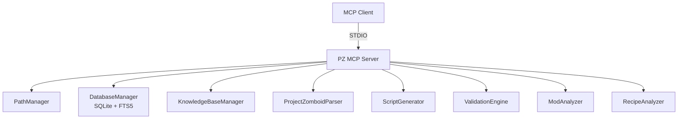

<div align="center">

# 🧟 PZ MCP Server

**AI-native tooling for Project Zomboid modding.**

Give Claude (or any MCP client) direct access to vanilla game data, script generation, validation, and Workshop analysis — all local, all offline.


[Quick Start](#-quick-start) · [Tools](#-tools) · [Configuration](#-configuration) · [Architecture](#-architecture) · [Contributing](#-contributing)

</div>

<br>

## ⚡ Why this exists

Modding Project Zomboid means digging through vanilla scripts, guessing at recipe chains, and hand-writing item definitions. This server puts a local, indexed copy of the game's data — plus your own docs — behind an MCP interface, so your AI assistant can search, generate, validate, and analyze mods directly in your workflow. No cloud calls, no API keys, nothing leaves your machine.

## ✨ Features

| | |
|---|---|
| 🔎 **Deep Search** | Full-text search across vanilla items, recipes, sounds, vehicles, and your modding docs |
| ✏️ **Script Generation** | Scaffold items, recipes, fixings, sounds, evolved recipes, and vehicles from templates |
| ✅ **Validation** | Catch syntax errors and broken references before they hit the game |
| 📊 **Mod Analysis** | Structure, balance, and compatibility checks in one pass |
| 🔗 **Recipe Graphs** | Walk crafting chains upstream/downstream, find conflicting duplicate recipes |
| 🛒 **Workshop Integration** | Search, fetch, and analyze any Steam Workshop mod |

## 🚀 Quick Start

```bash
git clone https://github.com/shakoorpour1991-sketch/pz-mcp-server.git
cd pz-mcp-server
npm install
npm run build
npm start
```

**Requires** Node.js ≥ 22.5.

### Connect to Claude Desktop

Add to `claude_desktop_config.json`, then restart:

```json
{
  "mcpServers": {
    "pz-mcp-server": {
      "command": "node",
      "args": ["/absolute/path/to/pz-mcp-server/dist/index.js"]
    }
  }
}
```

## 🛠 Tools

Every tool returns human-readable text **and** machine-readable data via MCP's `structuredContent` field.

#### Discovery
| Tool | What it does |
|---|---|
| `search_vanilla` | Full-text search over parsed items, recipes, sounds, vehicles |
| `search_knowledge_base` | Ranked search over your indexed modding docs |
| `list_knowledge_topics` | List all indexed doc topics with stats |
| `workshop_search` | Browse the PZ Steam Workshop |
| `workshop_get_details` | Full metadata for a Workshop item |

#### Scripts
| Tool | What it does |
|---|---|
| `generate_script` | Generate item/recipe/fixing/sound/evolvedrecipe/vehicle scripts |
| `validate_script` | Syntax + reference validation with suggestions |
| `check_references` | Validate refs against the parsed database |
| `export_mod_script` | Write generated scripts straight into a mod folder (dry-run by default) |

#### Analysis
| Tool | What it does |
|---|---|
| `analyze_mod` | Structure, Lua syntax, balance, and compatibility audit |
| `parse_game_files` | Parse PZ install into the local SQLite database |
| `index_knowledge_base` | Index markdown docs into a searchable FTS store |
| `analyze_recipe_chain` | Walk a recipe's dependency graph |
| `detect_recipe_conflicts` | Find items with duplicate crafting paths |
| `workshop_download` / `workshop_analyze` | Fetch a Workshop mod via SteamCMD and run the full analysis suite on it |

> Full parameter reference for each tool lives in [`TOOLS.md`](TOOLS.md).

## ⚙️ Configuration

All configuration is read from environment variables at startup.

| Variable | Default | Purpose |
|---|---|---|
| `PZ_MCP_DATA_DIR` | `./data` | SQLite database directory |
| `PZ_MCP_KB_PATH` | `D:\PZ-Modding\Documentation` | Knowledge base docs path |
| `PZ_MCP_LOG_LEVEL` | `info` | Log verbosity (`debug`/`info`/`warn`/`error`) |
| `PZ_GAME_VERSION` | `42.20` | Game build for compatibility checks |
| `PROJECTZOMBOID_PATH` / `PZ_PATH` | auto-detect | Override the PZ install path |
| `PZ_DECK_PORT` | `8787` | Admin dashboard port |

Game path detection covers standard Windows install locations and WSL automatically — set `PROJECTZOMBOID_PATH` only if auto-detect misses your setup.

## 📐 Architecture



**Typical flow:** parse game files → search references → generate scripts → validate → analyze mod → export.

## 🧑‍💻 Development

| Command | Description |
|---|---|
| `npm run build` | Compile TypeScript |
| `npm run dev` | Run with `tsx` (dev mode) |
| `npm start` | Run the compiled server |
| `npm run lint` | ESLint |
| `npm test` | Full test suite (205 tests) |

**Supported file formats:** `mod.info`, script `.txt` files (items, recipes, fixings, sounds), and `.lua` files (syntax + deprecated API checks).

## 🤝 Contributing

1. Fork the repo
2. Create a feature branch
3. Make your changes + add tests
4. Open a pull request

## 📄 License

MIT — see [LICENSE](LICENSE).

<div align="center">

**Built for the Project Zomboid modding community** 🧟

[Report an Issue](https://github.com/shakoorpour1991-sketch/pz-mcp-server/issues) · [Changelog](CHANGELOG.md) · [Discussions](https://github.com/shakoorpour1991-sketch/pz-mcp-server/discussions)

</div>
