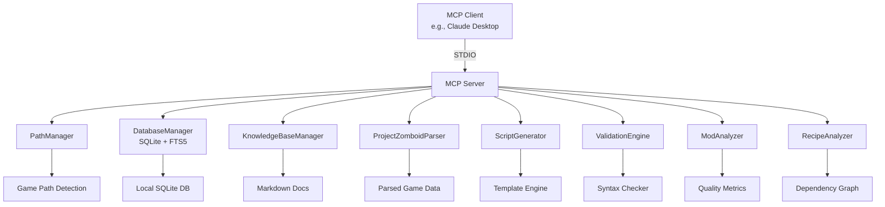
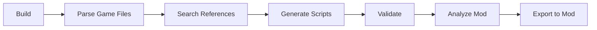

# 🧟 Project Zomboid MCP Server

<div align="center">


**🔧 Supercharge Your PZ Mod Development with AI-Powered Tools**

[Features](#-features) • [Installation](#-installation) • [Usage](#-usage) • [Tools](#-mcp-tools) • [Contributing](#-contributing)

</div>

---

## 🎯 Overview

<div align="center">

```
╔═══════════════════════════════════════════════════════════════╗
║     🎮 Project Zomboid + 🤖 AI = ⚡ Ultimate Mod Development   ║
╚═══════════════════════════════════════════════════════════════╝
```

</div>

A **local-only Model Context Protocol (MCP)** stdio server designed specifically for **Project Zomboid mod developers**. Connect seamlessly with any MCP client (Claude Desktop, etc.) to get intelligent assistance with script validation, generation, recipe analysis, and workshop integration.

---

## ✨ Features

<div align="center">

<table>
<tr>
<td align="center">
<svg width="60" height="60" viewBox="0 0 24 24" fill="none" xmlns="http://www.w3.org/2000/svg">
<circle cx="12" cy="12" r="10" stroke="#4CAF50" stroke-width="2"/>
<path d="M8 12l3 3 5-5" stroke="#4CAF50" stroke-width="2" stroke-linecap="round" stroke-linejoin="round"/>
</svg>
<br/><b>Smart Validation</b>
<br/><small>Syntax & reference checking</small>
</td>
<td align="center">
<svg width="60" height="60" viewBox="0 0 24 24" fill="none" xmlns="http://www.w3.org/2000/svg">
<rect x="3" y="3" width="18" height="18" rx="2" stroke="#2196F3" stroke-width="2"/>
<path d="M9 9h6M9 12h6M9 15h4" stroke="#2196F3" stroke-width="2" stroke-linecap="round"/>
</svg>
<br/><b>Script Generation</b>
<br/><small>Template-based scaffolding</small>
</td>
<td align="center">
<svg width="60" height="60" viewBox="0 0 24 24" fill="none" xmlns="http://www.w3.org/2000/svg">
<circle cx="11" cy="11" r="8" stroke="#FF9800" stroke-width="2"/>
<path d="M21 21l-4.35-4.35" stroke="#FF9800" stroke-width="2" stroke-linecap="round"/>
</svg>
<br/><b>Deep Search</b>
<br/><small>Vanilla data & knowledge base</small>
</td>
<td align="center">
<svg width="60" height="60" viewBox="0 0 24 24" fill="none" xmlns="http://www.w3.org/2000/svg">
<path d="M12 2L2 7l10 5 10-5-10-5z" stroke="#9C27B0" stroke-width="2"/>
<path d="M2 17l10 5 10-5M2 12l10 5 10-5" stroke="#9C27B0" stroke-width="2"/>
</svg>
<br/><b>Mod Analysis</b>
<br/><small>Structure, balance & compatibility</small>
</td>
</tr>
</table>

</div>

---

## 🛠️ Available Tools

### 🔍 Discovery & Search

| Tool | Description | Icon |
|------|-------------|------|
| `search_vanilla` | Full-text search of parsed game data (items, recipes, sounds, vehicles) | 🔎 |
| `search_knowledge_base` | Search indexed modding documentation with relevance ranking | 📚 |
| `list_knowledge_topics` | List all indexed topics with statistics | 📋 |
| `workshop_search` | Browse Steam Workshop items | 🛒 |
| `workshop_get_details` | Get full metadata for workshop items | ℹ️ |

### 📝 Script Operations

| Tool | Description | Icon |
|------|-------------|------|
| `generate_script` | Generate item, recipe, fixing, sound, evolvedrecipe, vehicle scripts | ✏️ |
| `validate_script` | Syntax and reference validation with suggestions | ✅ |
| `check_references` | Validate references against parsed database | 🔗 |
| `export_mod_script` | Write generated scripts directly to mod folders | 💾 |

### 🔬 Analysis Tools

| Tool | Description | Icon |
|------|-------------|------|
| `analyze_mod` | Comprehensive mod directory analysis | 📊 |
| `parse_game_files` | Parse PZ game files into local SQLite database | 🗄️ |
| `index_knowledge_base` | Index markdown docs into searchable FTS database | 📖 |
| `analyze_recipe_chain` | Walk recipe dependency graphs | 🔗 |
| `detect_recipe_conflicts` | Find duplicate crafting paths | ⚠️ |
| `workshop_analyze` | Download, parse & analyze workshop mods | 📦 |

---

## 🚀 Quick Start

<div align="center">

```bash
# Clone the repository
git clone https://github.com/shakoorpour1991-sketch/pz-mcp-server.git

# Navigate to project
cd pz-mcp-server

# Install dependencies
npm install

# Build the server
npm run build

# Run the server
npm start
```

</div>

---

## 🔌 Integration

### Claude Desktop Setup

Add this configuration to your `claude_desktop_config.json`:

```json
{
  "mcpServers": {
    "pz-mcp-server": {
      "command": "node",
      "args": ["/absolute/path/to/pz-mcp-server/dist/index.js"]
    }
  }
}
```

<div align="center">


</div>

---

## 📊 Architecture



---

## ⚙️ Configuration

### Environment Variables

| Variable | Default | Purpose |
|----------|---------|---------|
| `PZ_MCP_DATA_DIR` | `./data` | SQLite database directory |
| `PZ_MCP_KB_PATH` | `D:\PZ-Modding\Documentation` | Knowledge base path |
| `PZ_MCP_LOG_LEVEL` | `info` | Logging level |
| `PZ_GAME_VERSION` | `42.20` | Target game version |
| `PROJECTZOMBOID_PATH` | Auto-detect | Custom game install path |
| `PZ_DECK_PORT` | `8787` | Admin dashboard port |

---

## 📈 Development Workflow

<div align="center">



</div>

---

## 🎮 Supported Features

- ✅ **Build 42 Compatible** - Latest game structure support
- ✅ **Local Only** - No external API calls required
- ✅ **Multiple Script Types** - Items, recipes, sounds, vehicles & more
- ✅ **Balance Analysis** - Vanilla, powerful, weak modes
- ✅ **WSL Support** - Windows Subsystem for Linux detection
- ✅ **SteamCMD Integration** - Workshop download & analysis
- ✅ **Full-Text Search** - FTS5-powered rapid lookups
- ✅ **Structured Output** - Machine-readable `structuredContent` field

---

## 📝 License

<div align="center">

[](https://opensource.org/licenses/MIT)

**Built with ❤️ for the Project Zomboid modding community**

</div>

---

<div align="center">

### 🌟 Star this repo if you find it useful!

[Report Issues](https://github.com/shakoorpour1991-sketch/pz-mcp-server/issues) • [View Changelog](CHANGELOG.md) • [Join Discussion](https://github.com/shakoorpour1991-sketch/pz-mcp-server/discussions)

</div>

## Features

### Available Tools
- **search_vanilla** — Full-text search of parsed vanilla game data (items, recipes, sounds, vehicles)
- **generate_script** — Generate `item`, `recipe`, `fixing`, `sound`, `evolvedrecipe`, and `vehicle` scripts using templates
- **validate_script** — Syntax and reference validation with error/warning/suggestion output
- **check_references** — Validate item, sound, and sprite references against the database (run `parse_game_files` first)
- **analyze_mod** — Mod directory analysis: structure validation, Lua syntax checking, balance metrics, deprecated API detection
- **parse_game_files** — Parse Project Zomboid game files and populate the local SQLite database
- **index_knowledge_base** — Index markdown modding knowledge base docs (title, source, content) into a searchable FTS database (full re-index by default; `overwrite: false` = mtime-based incremental sync)
- **search_knowledge_base** — Full-text search of knowledge base docs with relevance ranking and topic filter
- **list_knowledge_topics** — List all indexed knowledge base topics with line/word/char stats
- **analyze_recipe_chain** — Walk the recipe dependency graph from an item or recipe: what it's made from, what it makes, and what consumes it
- **detect_recipe_conflicts** — Find items produced by more than one recipe (duplicate crafting paths)
- **export_mod_script** — Generate a script and write it into a mod's `media/scripts` folder (dry-run by default — no disk changes unless `dryRun: false`)
- **workshop_search** — Browse the Project Zomboid Steam Workshop (AppID 108600) by text (best-effort keyless HTML scrape; paste a URL/id for guaranteed resolution)
- **workshop_get_details** — Resolve full metadata for a workshop item from its id or steamcommunity URL (keyless Steam Web API, 24h cache; `forceRefresh` bypasses it)
- **workshop_download** — Download a workshop item via SteamCMD into the workshop workspace dir (`PZ_WORKSHOP_DIR` or `<Steam>/steamapps/workshop/content/108600`); refuses non-PZ items; disk-space guarded
- **workshop_analyze** — Fetch & Analyze: download (skips if already present), parse the mod's scripts into the DB, run the analysis suite, and return a full Mod Report

> Every tool returns both human-readable text **and** machine-readable structured data via the MCP `structuredContent` field.

### Path Detection
- Hardcoded path checks for common Project Zomboid install locations on Windows
- WSL path detection
- Manual path override via `gamePath` parameter

### Build 42 Compatibility
- Supports the Build 42 mod folder structure

### Dependencies
- `@modelcontextprotocol/sdk` 1.30
- `node:sqlite` (built-in, no native dependencies)
- `zod` 3.25
- Node >= 22.5

---

## Installation

### Prerequisites
- **Node.js 22.5.0 or higher**
- **npm** package manager

### Setup
```bash
git clone https://github.com/shakoorpour1991-sketch/pz-mcp-server.git
cd pz-mcp-server
npm install
npm run build
```

### npm Scripts
| Command | Description |
|---------|-------------|
| `npm run build` | Compile TypeScript (`tsc`) |
| `npm run dev` | Run with `tsx` (dev mode, requires successful build) |
| `npm start` | Run compiled server (`node dist/index.js`) |
| `npm run lint` | ESLint |
| `npm test` | Build + node:test (127 tests, 11 suites) |

---

## Usage

### Claude Desktop (STDIO)

Add to your `claude_desktop_config.json`:
```json
{
  "mcpServers": {
    "pz-mcp-server": {
      "command": "node",
      "args": ["/absolute/path/to/pz-mcp-server/dist/index.js"]
    }
  }
}
```

Restart Claude Desktop after editing the config. Requires a successful `npm run build` first.

### Manual STDIO
```bash
node dist/index.js
```

### Environment variables

All configuration is read from environment variables at startup (freebuff M4):

| Variable | Default | Purpose |
|---|---|---|
| `PZ_MCP_DATA_DIR` | `./data` (relative to cwd) | Directory for the SQLite databases. Set this when launching from an MCP client so the DB lands in a predictable location instead of the client's cwd. |
| `PZ_MCP_KB_PATH` | `D:\PZ-Modding\Documentation` | Markdown knowledge-base docs directory |
| `PZ_MCP_LOG_LEVEL` | `info` | pino log level (`debug`/`info`/`warn`/`error`) |
| `PZ_GAME_VERSION` | `42.20` | Game build used for mod compatibility checks |
| `PROJECTZOMBOID_PATH` / `PZ_PATH` | auto-detect | Explicit Project Zomboid install path (overrides registry/hardcoded detection) |
| `PZ_DECK_PORT` | `8787` | Dashboard/Control Deck port (`admin/bridge.mjs`) |

---

## MCP Tools

### search_vanilla
Search parsed vanilla game content with full-text search.

**Parameters:**
| Name | Type | Required | Description |
|------|------|----------|-------------|
| `query` | string | Yes | Search query |
| `type` | enum | No | Filter: `item`, `recipe`, `sound`, `vehicle`, `all` (default: `all`) |
| `category` | string | No | Filter by item category |
| `limit` | number | No | Max results, 1–100 (default: 20) |

**Output:** Text listing matching items with name, type, display name, and up to 5 properties.

---

### generate_script
Generate Project Zomboid scripts from templates.

**Supported types:** `item`, `recipe`, `fixing`, `sound`, `evolvedrecipe`, `vehicle`

**Parameters:**
| Name | Type | Required | Description |
|------|------|----------|-------------|
| `type` | enum | Yes | Script type |
| `name` | string | Yes | Name of the item/recipe/etc |
| `properties` | object | Yes | Script properties (e.g., `DisplayName`, `Type`, `MaxDamage`) |
| `module` | string | No | Module name (default: `"Base"`) |
| `balance` | enum | No | Balance mode: `vanilla` (default), `powerful`, `weak`, `custom` (no adjustments) |
| `includeComments` | boolean | No | Include explanatory comments in the generated script (default: `false`) |

**Output:** Formatted script block with generated Lua/INI content.

---

### validate_script
Validate script syntax and references.

**Parameters:**
| Name | Type | Required | Description |
|------|------|----------|-------------|
| `content` | string | Yes | Script content to validate |
| `type` | enum | No | Expected type: `item`, `recipe`, `evolvedrecipe`, `fixing`, `sound`, `vehicle` |
| `strict` | boolean | No | Enable strict validation (default: `false`) |

**Output:** Validation status (valid/invalid), list of errors (with line numbers and suggestions), warnings, and general suggestions.

---

### check_references
Validate item, sound, and sprite references against the parsed database.

**Parameters:**
| Name | Type | Required | Description |
|------|------|----------|-------------|
| `references` | string[] | Yes | List of reference strings to check |
| `type` | enum | No | Type filter: `item`, `sound`, `sprite`, `all` (default: `all`) |

**Output:** Count of valid/invalid references, list of invalid refs with error messages and suggestions.

> Note: The database is empty until `parse_game_files` has been run.

---

### analyze_mod
Analyze a mod directory for structure, syntax, compatibility, and balance.

**Parameters:**
| Name | Type | Required | Description |
|------|------|----------|-------------|
| `modPath` | string | Yes | Path to mod directory |
| `checkBalance` | boolean | No | Perform balance analysis (default: `true`) |
| `checkCompatibility` | boolean | No | Check vanilla compatibility (default: `true`) |

**Output:** Mod name, path, structure validation results (mod. info, scripts, Lua, assets), issues grouped by severity, balance score and recommendations.

---

### parse_game_files
Parse Project Zomboid game files and populate the local SQLite database.

**Parameters:**
| Name | Type | Required | Description |
|------|------|----------|-------------|
| `gamePath` | string | No | Path to PZ installation (auto-detected if omitted) |
| `forceReparse` | boolean | No | Re-parse even if data exists (default: `false`) |

**Output:** Counts of parsed items, recipes, sounds, vehicles; file count and parse time; any parse errors.

---

### index_knowledge_base
Index markdown knowledge base docs (title, source, content) into a searchable FTS database.

**Parameters:**
| Name | Type | Required | Description |
|------|------|----------|-------------|
| `path` | string | No | Path to the knowledge base docs dir (default: `PZ_MCP_KB_PATH` env or `D:\PZ-Modding\Documentation`) |
| `overwrite` | boolean | No | Re-index existing topics (default: `true`) |

**Output:** Counts of indexed topics, files found, total characters; any per-file errors.

---

### search_knowledge_base
Full-text search of knowledge base docs with relevance ranking and topic filter.

**Parameters:**
| Name | Type | Required | Description |
|------|------|----------|-------------|
| `query` | string | Yes | Search query |
| `topic` | string | No | Filter by exact topic (filename without `.md`) |
| `limit` | number | No | Max results, 1–100 (default: 10) |

**Output:** Matching topics ranked by relevance (bm25), each with title, score, and a content snippet.

---

### list_knowledge_topics
List all indexed knowledge base topics with stats.

**Parameters:** none

**Output:** Each indexed topic with title, line/word/char counts.

---

### analyze_recipe_chain
Walk the recipe dependency graph built from the `references` table during parsing.

**Parameters:**
| Name | Type | Required | Description |
|------|------|----------|-------------|
| `seed` | string | Yes | Item or recipe id to start from |
| `direction` | enum | No | `upstream` (what makes it), `downstream` (what it makes / consumes it), `both` (default) |
| `maxDepth` | number | No | Chain depth, 1–10 (default: 3) |

**Output:** Ordered chain of nodes (recipes with their ingredients/results, items with their producers/consumers).

---

### detect_recipe_conflicts
Find items produced by more than one recipe — duplicate crafting paths the game may resolve unexpectedly.

**Parameters:**
| Name | Type | Required | Description |
|------|------|----------|-------------|
| `limit` | number | No | Max conflicts, 1–200 (default: 50) |

**Output:** List of conflicting items and the recipes that produce each.

---

### export_mod_script
Generate a script and (optionally) write it into a mod's `media/scripts` folder.

**Parameters:**
| Name | Type | Required | Description |
|------|------|----------|-------------|
| `modPath` | string | Yes | Path to the mod directory (path-validated; must be absolute and existing) |
| `type` | enum | Yes | `item`, `recipe`, `evolvedrecipe`, `fixing`, `sound`, `vehicle` |
| `name` | string | Yes | Script name (sanitized into the output filename) |
| `properties` | object | No | Script properties (default: `{}`) |
| `module` | string | No | Module name (default: `"Base"`) |
| `balance` | enum | No | Balance mode (same as `generate_script`) |
| `includeComments` | boolean | No | Include explanatory comments |
| `dryRun` | boolean | No | Preview only — no disk changes (default: `true`) |

**Output:** Target file path + generated content. With `dryRun: false` the file is written (path stays inside `<modPath>/media/scripts`).

---

## Development Workflow

1. **Build:** `npm run build`
2. **Parse game data:** Call `parse_game_files` with your PZ install path (or let it auto-detect)
3. **Search for references:** Use `check_references` to validate item/sound/sprite names against the database
4. **Generate scripts:** Use `generate_script` to scaffold item/recipe/fixing/sound scripts
5. **Validate:** Use `validate_script` to check syntax before adding to your mod
6. **Analyze:** Use `analyze_mod` to audit your mod's structure, balance, and compatibility

---

## Supported File Formats
- **mod.info** — Mod metadata
- **Script files (.txt)** — Items, recipes, fixing scripts, sounds
- **Lua files (.lua)** — Syntax checking (parentheses/brackets balance), deprecated API detection

---

## Architecture

```
MCP Server (StdioServerTransport)
  ├── PathManager          — Game install detection
  ├── DatabaseManager      — SQLite + FTS5
  ├── KnowledgeBaseManager — KB docs indexing + FTS5 search
  ├── ProjectZomboidParser — Game file parsing
  ├── ScriptGenerator      — Template-based script generation
  ├── ValidationEngine     — Syntax + reference validation
  ├── ModAnalyzer          — Mod analysis + quality metrics
  └── RecipeAnalyzer       — Recipe-chain graph + conflict detection
```

---

## Contributing

1. Fork the repository
2. Create a feature branch
3. Make your changes
4. Add tests for new functionality
5. Submit a pull request

---

## License

MIT License — see the [LICENSE](LICENSE) file for details.

---

**Built for the Project Zomboid modding community**