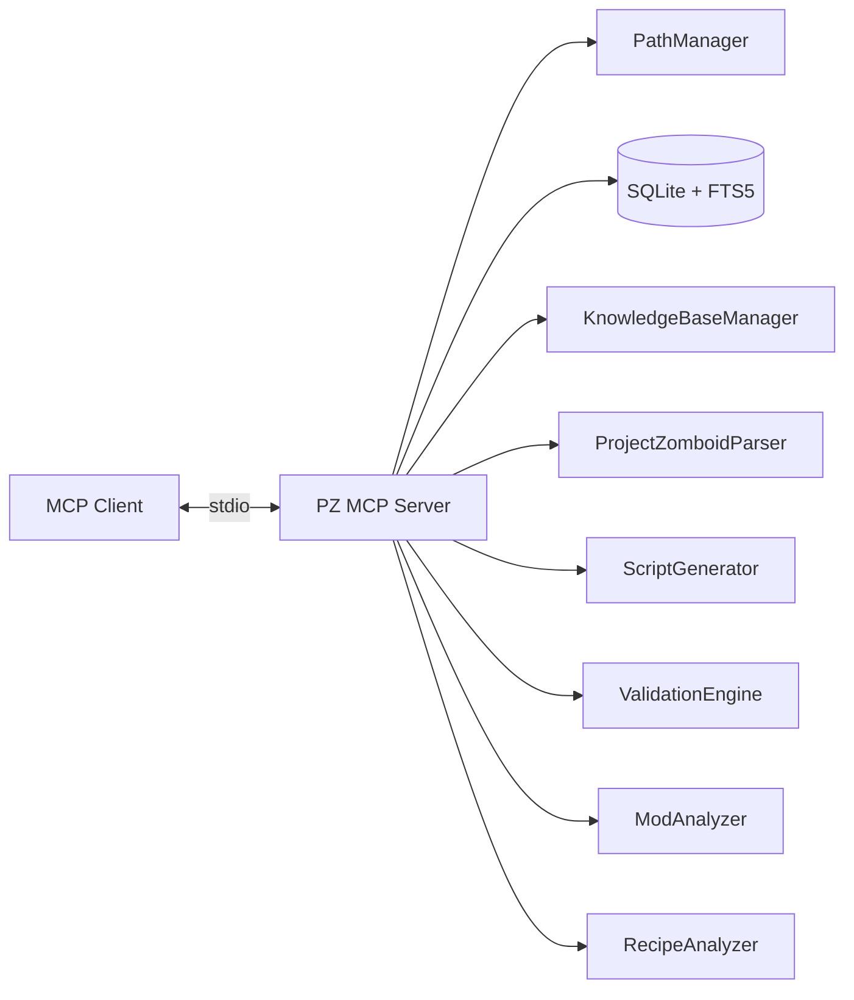

<div align="center">

```text
██████╗ ███████╗     ███╗   ███╗ ██████╗██████╗
██╔══██╗╚══███╔╝     ████╗ ████║██╔════╝██╔══██╗
██████╔╝  ███╔╝█████╗██╔████╔██║██║     ██████╔╝
██╔═══╝  ███╔╝ ╚════╝██║╚██╔╝██║██║     ██╔═══╝
██║     ███████╗     ██║ ╚═╝ ██║╚██████╗██║
╚═╝     ╚══════╝     ╚═╝     ╚═╝ ╚═════╝╚═╝

      ███╗   ███╗ ██████╗██████╗
      ████╗ ████║██╔════╝██╔══██╗
      ██╔████╔██║██║     ██████╔╝
      ██║╚██╔╝██║██║     ██╔═══╝
      ██║ ╚═╝ ██║╚██████╗██║
      ╚═╝     ╚═╝ ╚═════╝╚═╝
```

# `> PZ_MCP_SERVER // GHOST MODE`

**PROJECT ZOMBOID MODDING INTELLIGENCE FOR MCP CLIENTS**

[](https://nodejs.org/)
[](https://www.typescriptlang.org/)
[](https://modelcontextprotocol.io/)
[](https://www.sqlite.org/)
[](https://projectzomboid.com/)

`[ STATUS: ONLINE ]` · `[ MODE: LOCAL-FIRST ]` · `[ SIGNAL: MCP/STDIO ]` · `[ THREAT: ZERO TRUST ]`

</div>

```text
┌──────────────────────────────────────────────────────────────────────────────┐
│                                                                              │
│   [SYSTEM BOOT]                                                             │
│                                                                              │
│   > connecting to Project Zomboid data...                                   │
│   > indexing vanilla definitions...                                         │
│   > loading modding knowledge...                                            │
│   > mounting MCP toolchain...                                               │
│   > validating payload boundaries...                                        │
│   > ghost mode: ACTIVE                                                      │
│                                                                              │
│   ██████╗ ███████╗███████╗██████╗ ██████╗  █████╗ ████████╗██╗              │
│   ██╔══██╗╚══███╔╝██╔════╝██╔══██╗██╔══██╗██╔══██╗╚══██╔══╝██║              │
│   ██████╔╝  ███╔╝ █████╗  ██████╔╝██████╔╝███████║   ██║   ██║              │
│   ██╔═══╝  ███╔╝  ██╔══╝  ██╔══██╗██╔══██╗██╔══██║   ██║   ██║              │
│   ██║     ███████╗███████╗██║  ██║██║  ██║██║  ██║   ██║   ██║              │
│   ╚═╝     ╚══════╝╚══════╝╚═╝  ╚═╝╚═╝  ╚═╝╚═╝  ╚═╝   ╚═╝   ╚═╝              │
│                                                                              │
│   STOP MAKING YOUR AI GUESS. GIVE IT THE SOURCE.                            │
│                                                                              │
└──────────────────────────────────────────────────────────────────────────────┘
```

> **PZ MCP Server** turns Project Zomboid's local game data, documentation, scripts, recipes, mods, and Workshop metadata into an MCP-accessible intelligence layer. Search the source. Generate against it. Validate the payload. Analyze the result. 🟢

---

## `> MATRIX // SYSTEM FLOW`

```text
              ┌───────────────────────┐
              │ PROJECT ZOMBOID       │
              │ INSTALL / VANILLA     │
              └───────────┬───────────┘
                          │ parse / index
                          ▼
┌─────────────────┐   ┌──────────────────────┐   ┌─────────────────┐
│ MODDING DOCS    │──▶│   PZ MCP SERVER      │◀──│ EXISTING MODS   │
│ markdown / refs │   │                      │   │ / WORKSHOP      │
└─────────────────┘   │ SEARCH               │   └─────────────────┘
                      │ GENERATE             │
                      │ VALIDATE             │
                      │ ANALYZE              │
                      │ TRACE                │
                      └──────────┬───────────┘
                                 │ MCP / stdio
                                 ▼
                      ┌──────────────────────┐
                      │ YOUR AI CLIENT       │
                      │                       │
                      │ inspect → inject     │
                      │ build → verify       │
                      │ analyze → export     │
                      └──────────────────────┘
```

**Core loop:** `PARSE → SEARCH → GENERATE → VALIDATE → ANALYZE → EXPORT`

---

## `> CAPABILITIES // PAYLOAD MATRIX`

| Channel | Capability | Signal |
|---|---|---|
| 🔥 `DISCOVERY` | Search vanilla items, recipes, sounds, vehicles | `HIGH` |
| ⚡ `KNOWLEDGE` | Index and search Markdown modding documentation | `HIGH` |
| 💀 `SCRIPT` | Generate item/recipe/fixing/sound/evolvedrecipe/vehicle scripts | `HIGH` |
| 🛡️ `VALIDATION` | Syntax and reference validation | `HIGH` |
| 🔥 `ANALYSIS` | Inspect mod structure, Lua, balance, compatibility | `HIGH` |
| ⚡ `RECIPES` | Trace dependencies and detect crafting conflicts | `HIGH` |
| 💀 `WORKSHOP` | Search, inspect, download, and analyze Workshop items | `EXTERNAL` |
| 🛡️ `EXPORT` | Export generated scripts with safety-oriented dry-run support | `LOCAL` |

### Tool map

```text
DISCOVERY
├── search_vanilla
├── search_knowledge_base
└── list_knowledge_topics

SCRIPT
├── generate_script
├── validate_script
├── check_references
└── export_mod_script

LOCAL DATA
├── parse_game_files
└── index_knowledge_base

ANALYSIS
├── analyze_mod
├── analyze_recipe_chain
└── detect_recipe_conflicts

WORKSHOP
├── workshop_search
├── workshop_get_details
├── workshop_download
└── workshop_analyze
```

Full parameters and examples: [`TOOLS.md`](TOOLS.md).

---

## `> INSTALL // JACK IN`

```bash
# clone the payload
git clone https://github.com/shakoorpour1991-sketch/pz-mcp-server.git
cd pz-mcp-server

# install dependencies
npm install

# compile the signal
npm run build

# launch the node
npm start
```

**Runtime:** Node.js `>= 22.5`.

### MCP configuration

```json
{
  "mcpServers": {
    "pz-mcp-server": {
      "command": "node",
      "args": ["/absolute/path/to/pz-mcp-server/dist/index.js"]
    }
  }
}
```

---

## `> CONFIG // ENVIRONMENT`

| Variable | Default | Function |
|---|---|---|
| `PZ_MCP_DATA_DIR` | `./data` | SQLite database directory |
| `PZ_MCP_KB_PATH` | `D:\PZ-Modding\Documentation` | Documentation source |
| `PZ_MCP_LOG_LEVEL` | `info` | `debug` / `info` / `warn` / `error` |
| `PZ_GAME_VERSION` | `42.20` | Compatibility target |
| `PROJECTZOMBOID_PATH` / `PZ_PATH` | auto-detect | Game installation override |
| `PZ_DECK_PORT` | `8787` | Admin dashboard port |

---

## `> STREAM // LIVE TRACE`

```text
[07:41:02.013] [BOOT]       establishing MCP transport ............ OK
[07:41:02.087] [DB]         SQLite + FTS5 mounted ................ OK
[07:41:02.194] [PARSER]     vanilla definitions discovered ........ OK
[07:41:02.351] [KB]         documentation index online ............ OK
[07:41:02.418] [TOOLS]      capability registry loaded ........... OK
[07:41:02.420] [SECURITY]   boundary checks armed ................ OK
[07:41:02.421] [GHOST]      local-first mode ........................ ON

> incoming payload: search_vanilla
> resolving reference: Base.WoodenPlank
> querying FTS index...
> result: MATCH
> returning structuredContent...

[TRACE] signal complete // no hallucinated source required.
```

---

## `> ARCHITECTURE // THE GRID`



The core game-data/documentation workflow is local-first. Workshop functionality is a separate external boundary because it interacts with Steam Workshop and SteamCMD.

---

## `> OPERATIONS // COMMAND DECK`

| Command | Function |
|---|---|
| `npm run build` | Compile TypeScript |
| `npm run dev` | Development mode via `tsx` |
| `npm start` | Run compiled server |
| `npm run lint` | ESLint |
| `npm test` | Test suite |

---

## `> SECURITY // ZERO TRUST`

Treat MCP inputs as hostile payloads until validated.

- 🔒 Validate tool arguments at the boundary.
- 🔒 Canonicalize filesystem paths before writes.
- 🔒 Keep generated exports inside an intended workspace.
- 🔒 Treat SteamCMD and downloaded Workshop data as external/untrusted.
- 🔒 Use dry-run behavior where mutation is unnecessary.
- 🔒 Keep external side effects visibly separated from read-only analysis.

The server does **not** claim automatic game launch, gameplay, or automated mod play-testing merely because those capabilities would be useful. The documented surface is the source of truth.

---

## `> DEV // BUILD THE NEXT PAYLOAD`

```bash
npm install
npm run build
npm run lint
npm test
```

### Contribution protocol

```text
[01] FORK THE NODE
[02] CREATE YOUR BRANCH
[03] ISOLATE THE PAYLOAD
[04] TEST BEFORE TRANSMISSION
[05] KEEP THE DIFF CLEAN
[06] OPEN THE PR
[07] WAIT FOR THE GRID TO VERIFY
```

Contribution rules:

- Keep changes scoped. One breach, one payload.
- Add tests when changing behavior.
- Do not silently change public MCP tool semantics.
- Do not commit generated noise or local game data.
- Document new tools and configuration.
- Run build, lint, and tests before transmission.

---

## `> CURRENT BOUNDARIES // READ THE SIGNAL`

PZ MCP Server currently focuses on **local data intelligence, MCP tooling, generation, validation, analysis, recipe reasoning, and Workshop inspection**.

It does **not** establish automatic:

- Project Zomboid game launching
- gameplay automation
- automated in-game mod play-testing

Those are future expansion targets, not claims about the current tool surface.

---

## `> LICENSE // OPEN THE GATE`

See the repository license and documentation for the authoritative project terms.

---

<div align="center">

```text
                 .-=========-.
                 \'-=======-'/
                 _|   .=.   |_
                ((|  {{1}}  |))
                 \|   /|\   |/
                  \__ '`' __/
                    _`) (`_
                  _/_______\_
                 /___________\

          ██████╗ ██╗  ██╗███████╗██████╗
          ██╔══██╗╚██╗██╔╝██╔════╝██╔══██╗
          ██████╔╝ ╚███╔╝ █████╗  ██████╔╝
          ██╔══██╗ ██╔██╗ ██╔══╝  ██╔══██╗
          ██████╔╝██╔╝ ██╗███████╗██║  ██║
          ╚═════╝ ╚═╝  ╚═╝╚══════╝╚═╝  ╚═╝

                 > SIGNAL LOST_
                 > CONNECTION CLOSED_
                 > GHOST REMAINS.
```

**LOCAL DATA → MCP TOOLS → CONTEXTUAL AI ACTION**

[`TOOLS.md`](TOOLS.md) · [`CHANGELOG.md`](CHANGELOG.md) · [Issues](https://github.com/shakoorpour1991-sketch/pz-mcp-server/issues) · [Discussions](https://github.com/shakoorpour1991-sketch/pz-mcp-server/discussions)

</div>
