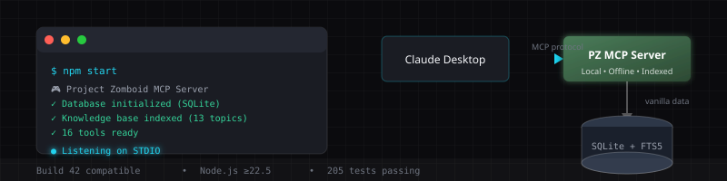
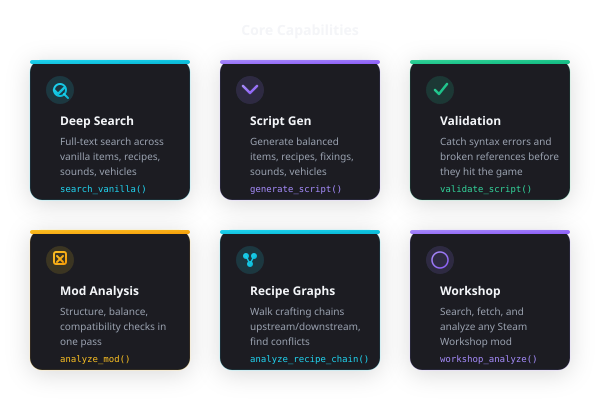
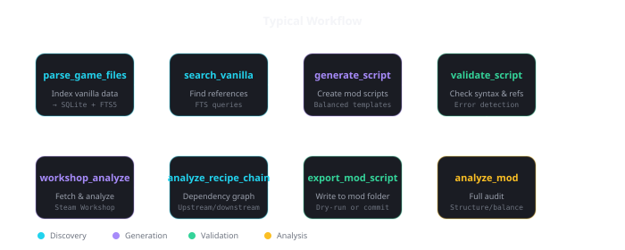
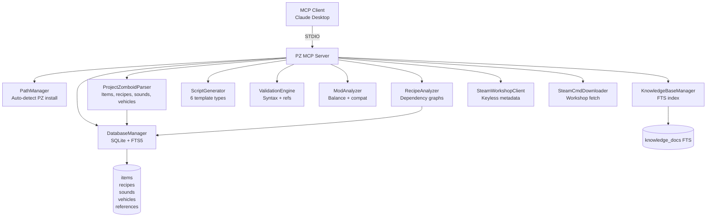

<div align="center">



</div>

```
┌─────────────────────────────────────────────────────────────────────┐
│  PZ_MCP_SERVER — Local vanilla data interface for AI modding       │
│  ██████╗ ██╗    ██╗███████╗███████╗     ██╗ ██████╗ ██╗   ██╗███████╗│
│  ██╔══██╗██║    ██║██╔════╝██╔════╝     ██║██╔═══██╗██║   ██║██╔════╝│
│  ██████╔╝██║ █╗ ██║█████╗  ███████╗     ██║██║   ██║██║   ██║█████╗  │
│  ██╔══██╗██║███╗██║██╔══╝  ╚════██║     ██║██║   ██║██║   ██║██╔══╝  │
│  ██████╔╝╚███╔███╔╝███████╗███████║     ██║╚██████╔╝╚██████╔╝███████╗│
│  ╚═════╝  ╚══╝╚══╝ ╚══════╝╚══════╝     ╚═╝ ╚═════╝  ╚═════╝ ╚══════╝
└─────────────────────────────────────────────────────────────────────┘
```

**Give your AI assistant direct access to Project Zomboid's vanilla data — local, offline, indexed.**

[Quick Start](#-quick-start) • [Tools](#-tools) • [Workflow](#-workflow) • [Architecture](#-architecture)

---

## 🎯 The Problem

Modding Project Zomboid means drowning in **thousands of vanilla script files**. You need to know:

- What properties `Base.Axe` actually has (and there *are* dozens of axes)
- Which recipes consume `Base.Plank` (**all 36 of them**)
- Whether `KatanaSwing` exists before referencing it in your sound script
- How `tags[base:flour]` resolves in B42's bracket ingredient syntax

This server puts a **local, indexed copy of the game's data** behind an MCP interface. Claude Desktop (or any MCP client) can search, generate, validate, and analyze mods directly in your workflow. No cloud calls. No API keys. Nothing leaves your machine.

---

## 📊 The Numbers

| Metric | Value |
|--------|-------|
| Vanilla items indexed | ~3,800+ |
| Recipe ingredient rows | 3,848 (includes 758 tag-based inputs) |
| Knowledge base topics | 13 research docs (~280 KB) |
| MCP tools | 16 |
| Tests passing | 205 |
| Node.js required | ≥ 22.5 |

---

<div align="center">



</div>

---

## 🔧 Quick Start

```bash
git clone https://github.com/shakoorpour1991-sketch/pz-mcp-server.git
cd pz-mcp-server
npm install
npm run build
npm start
```

### Connect to Claude Desktop

Add to `claude_desktop_config.json`, then restart:

```json
{
  "mcpServers": {
    "pz-mcp-server": {
      "command": "node",
      "args": ["/absolute/path/to/pz-mcp-server/dist/index.js"]
    }
  }
}
```

---

## 🔄 Workflow

<div align="center">



</div>

**Data flow:** `parse_game_files` → populate SQLite → `search_vanilla` / `analyze_recipe_chain` → `generate_script` → `validate_script` → `export_mod_script`

---

## 🛠️ Tools

Every tool returns human-readable text **and** machine-readable JSON via MCP's `structuredContent` field.

### Discovery

| Tool | Purpose |
|------|---------|
| `search_vanilla` | Full-text search over parsed items, recipes, sounds, vehicles with filters (category, weight, calories, tags, type) |
| `search_recipes` | Search structured craft recipes by ingredient, tool, skill requirement, category, or result |
| `search_knowledge_base` | Ranked search over your indexed modding docs (BM25 scoring) |
| `list_knowledge_topics` | List all indexed doc topics with line/word/char stats |
| `workshop_search` | Browse the PZ Steam Workshop (AppID 108600) — best-effort keyless scrape |
| `workshop_get_details` | Resolve full metadata for a Workshop item from id or URL (Steam Web API, 24h cache) |

### Generation

| Tool | Purpose |
|------|---------|
| `generate_script` | Generate balanced scripts: `item`, `recipe`, `fixing`, `sound`, `evolvedrecipe`, `vehicle` |
| `export_mod_script` | Generate + write into a mod's `media/scripts` folder (dry-run by default) |

### Validation

| Tool | Purpose |
|------|---------|
| `validate_script` | Syntax + reference validation with line-level error reporting and suggestions |
| `check_references` | Validate item/sound/sprite refs against the parsed database; reports `defined`, `referenced-only`, or `missing` |

### Analysis

| Tool | Purpose |
|------|---------|
| `analyze_mod` | Structure, Lua syntax, balance outliers, and compatibility audit |
| `parse_game_files` | Parse PZ install into the local SQLite database |
| `index_knowledge_base` | Index markdown docs into a searchable FTS store (mtime-based incremental sync) |
| `analyze_recipe_chain` | Walk the recipe dependency graph: upstream (what makes this), downstream (what this makes). Supports `expandNode` for delta updates and `target` for shortest-path finding |
| `detect_recipe_conflicts` | Find items produced by multiple recipes — ranked by severity (`high` for exact duplicates on real item rows, `low` for tag/mapper multi-paths the game tolerates) |
| `workshop_download` | Fetch a Workshop mod via SteamCMD into `PZ_WORKSHOP_DIR` or `<Steam>/steamapps/workshop/content/108600` |
| `workshop_analyze` | Download → parse → run full analysis suite → return Mod Report (what it adds, quality score, issues, recommendations) |

Full parameter reference lives in [`TOOLS.md`](TOOLS.md).

---

## 🏗️ Architecture



---

## ⚙️ Configuration

All configuration is read from environment variables at startup.

| Variable | Default | Purpose |
|----------|---------|---------|
| `PZ_MCP_DATA_DIR` | `./data` | SQLite database directory |
| `PZ_MCP_KB_PATH` | `D:\PZ-Modding\Documentation` | Knowledge base docs path |
| `PZ_MCP_LOG_LEVEL` | `info` | Log verbosity (`debug`/`info`/`warn`/`error`) |
| `PZ_GAME_VERSION` | `42.20` | Game build for compatibility checks |
| `PROJECTZOMBOID_PATH` / `PZ_PATH` | auto-detect | Override the PZ install path |
| `PZ_DECK_PORT` | `8787` | Admin dashboard (Control Deck) port |

Game path detection covers standard Windows install locations and WSL automatically — set `PROJECTZOMBOID_PATH` only if auto-detect misses your setup.

---

## 🧪 Development

| Command | Description |
|---------|-------------|
| `npm run build` | Compile TypeScript |
| `npm run dev` | Run with `tsx` (dev mode) |
| `npm start` | Run the compiled server |
| `npm run lint` | ESLint (covers `src/`, `tests/`, `admin/`, `scripts/`) |
| `npm run format:check` | Prettier check |
| `npm test` | Full test suite (205 tests via `node:test`) |
| `npm run verify:deck` | Dashboard smoke test |
| `npm run dashboard` | Launch the Control Deck admin UI |

**Supported file formats:** `mod.info`, script `.txt` files (items, recipes, fixings, sounds), and `.lua` files (syntax + deprecated API checks).

---

## 📁 What's Inside

```
pz-mcp-server/
├── src/
│   ├── analyzers/        # ModAnalyzer, RecipeAnalyzer
│   ├── database/         # DatabaseManager (SQLite + FTS5)
│   ├── generators/       # ScriptGenerator (6 template types)
│   ├── knowledge/        # KnowledgeBaseManager
│   ├── parsers/          # ProjectZomboidParser
│   ├── utils/            # PathManager, formatters, FTS util
│   ├── validation/       # ValidationEngine
│   ├── workshop/         # SteamWorkshopClient, SteamCmdDownloader
│   └── index.ts          # MCP server entry point
├── admin/
│   ├── bridge.mjs        # RPC bridge for Control Deck
│   └── index.html        # Control Deck UI (live monitoring + tool playground)
├── knowledge-base/       # 13 Build 42 research docs
├── tests/                # 205 unit + integration tests
└── tools/                # TOOL.md (full parameter reference)
```

---

## 💀 Why This Exists

I was tired of:

1. Opening 20 vanilla script files to find one property value
2. Guessing whether a sound reference existed
3. Manually tracing recipe chains through bracket syntax
4. Writing boilerplate item definitions by hand

So I built a local index of the game's data and exposed it through MCP. Now I ask Claude:

> "Show me all recipes that consume Base.Plank, sorted by skill requirement"

And get an answer in seconds — no manual grep, no spreadsheet, no tab-hopping.

---

## ⚠️ Limitations

- **Windows-first**: Auto-detection targets Steam/Epic/GOG on Windows. WSL works; Linux/Mac may need `PROJECTZOMBOID_PATH` set manually.
- **Workshop scraping is best-effort**: `workshop_search` parses the community browse page HTML. For guaranteed resolution, use `workshop_get_details` with a URL or id.
- **Build 42 focus**: Tested against 42.18 / 42.20. B41 support is not a goal.
- **No cloud, no magic**: Everything runs locally. You need a PZ install and (for Workshop features) SteamCMD.

---

<div align="center">

**Built for the Project Zomboid modding community** 🧟

[Report an Issue](https://github.com/shakoorpour1991-sketch/pz-mcp-server/issues) · [Changelog](CHANGELOG.md) · [Tool Reference](TOOLS.md)

</div>
